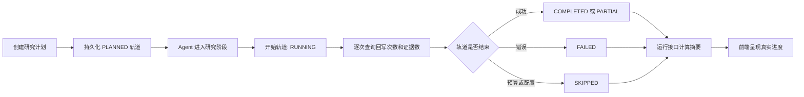

# 归因研究真实进度实现方案

## 背景与问题

归因任务启动后，Harness 会根据研究计划一次性创建所有轨道，并将其写为 `PENDING`。但 Agent 在实际执行搜索时，只在内存中累计每条轨道的查询次数、成功次数和证据数量，直到整个研究结束才统一写回最终状态。

这使得运行中的接口无法区分“已规划但未启动”和“正在执行”，并且缺少当前轨道、实时尝试次数、实时证据数量等事实。前端把所有 `PENDING` 轨道计为总数后，会呈现 `0/5` 和多张“等待中”卡片，造成进度误导。

## 目标

1. 将研究计划轨道与实际执行轨道明确区分。
2. 每次真实查询开始、成功、失败或因预算跳过时，立即持久化对应轨道状态。
3. 由后端计算并返回统一进度摘要，前端不再推断轨道进度。
4. 保持运行中页面的信息密度，完成报告恢复为单列全宽阅读流。
5. 兼容数据库中已有的 `PENDING` 历史轨道。

## 状态语义

| 状态 | 含义 | 是否属于真实执行进度 |
| --- | --- | --- |
| `PLANNED` | 已纳入研究计划，尚未开始 | 否 |
| `RUNNING` | 已开始执行，尚未结算 | 是 |
| `COMPLETED` | 执行完成且得到有效证据 | 是 |
| `PARTIAL` | 已执行，但存在证据不足或部分请求失败 | 是 |
| `FAILED` | 已执行且请求全部失败 | 是 |
| `SKIPPED` | 因配置或预算限制未执行 | 是 |

旧记录中的 `PENDING` 视为 `PLANNED`，仅用于兼容读取，不计入已启动或已结算数量。

## 架构与数据流



`AttributionAgent` 不直接依赖 DAO。Harness 创建一个 `AttributionResearchProgressListener`，Agent 在阶段与轨道事件发生时调用该监听器，Harness 再负责更新运行表和步骤表。这样研究执行、状态持久化和页面展示保持单向依赖。

## 后端变更

### 1. 研究步骤持久化

- 初始化时写入 `PLANNED`，不设置 `startedAt` 或 `endedAt`。
- 步骤首次开始时改为 `RUNNING` 并写入 `startedAt`。
- 每次搜索请求结束后，回写 `attempt`、`outputSummary`、`errorMessage`。
- 轨道结束时写入终态和 `endedAt`。
- 仓储层的 upsert 保留已有开始时间，避免中间进度更新覆盖首次启动时间。

### 2. 运行状态

- 增加仅更新 `currentStep` 的仓储方法。
- 阶段切换时同步更新 `currentStep`。
- 运行最终状态仍由报告成功持久化后统一标记，避免出现报告与研究运行状态分裂。

### 3. 进度接口

`GET /api/attribution/reports/{reportId}/run` 在原有 `run`、`steps` 基础上增加 `progress`：

```json
{
  "progress": {
    "plannedTracks": 5,
    "activatedTracks": 2,
    "settledTracks": 1,
    "currentTrack": "INDUSTRY",
    "currentStep": "web-search"
  }
}
```

其中 `activatedTracks` 仅统计 `RUNNING` 与终态；`settledTracks` 统计 `COMPLETED`、`PARTIAL`、`FAILED`、`SKIPPED`；`currentTrack` 取正在执行的轨道。

## 前端变更

- 扩展研究运行类型，消费后端 `progress`。
- 没有已启动轨道时展示“已规划 N 条轨道，等待执行”，不显示 `0/N`，也不渲染等待卡片。
- 已启动后显示“已启动 A/N，已结算 B/N”，轨道卡片仅展示 `RUNNING` 和终态。
- 完成报告去除双栏容器，恢复摘要、驱动、不确定性、后续验证、证据的全宽纵向阅读顺序。

## 测试与验证

1. DAO 测试：计划轨道为 `PLANNED` 且无时间戳；实时更新保留原始开始时间。
2. Harness 测试：阶段推进与轨道开始、更新、完成会写入运行表和步骤表。
3. Agent 测试：搜索期间产生的查询次数、证据数和终态通过监听器回写。
4. API 视图测试：`progress` 正确区分计划、已启动和已结算轨道，并兼容旧 `PENDING`。
5. 前端测试：计划轨道不显示为 `0/N`；完成报告不再包含双栏容器。
6. 验证命令：相关 Maven 模块测试、前端组件测试、前端生产构建和 `git diff --check`。

## 非目标

- 不改变研究计划生成规则或搜索预算。
- 不增加新的外部依赖。
- 不为每次查询新增独立数据库行；仍以每条轨道一行进行增量更新。
