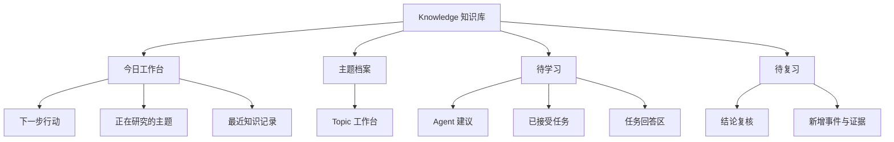
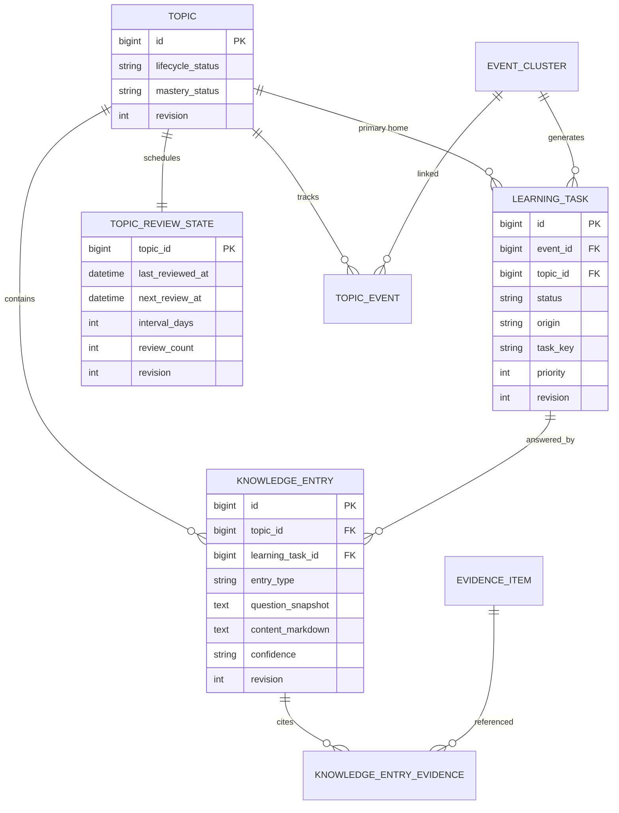
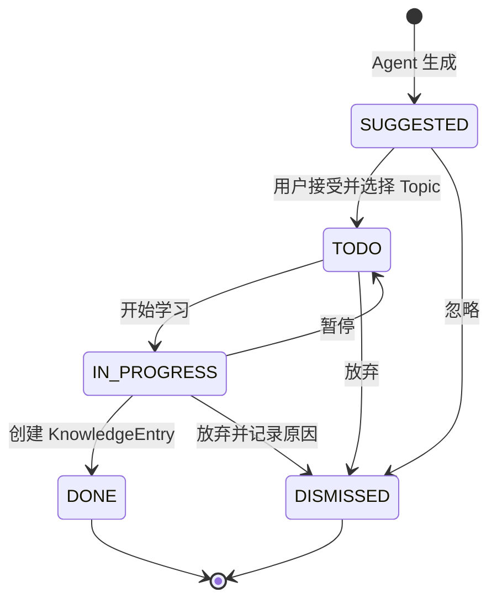

# FinScope 知识工作台重构设计

## 1. 设计目标

把现有 `Topics` 与 `Learning` 两个割裂页面重构为一个结构清晰、资料完整、行动明确的 `Knowledge / 知识库` 工作台。

本设计的核心不是合并两个 React 组件，而是建立可信的知识沉淀领域：

1. Agent 输出只是建议，不自动制造用户待办。
2. 学习任务必须正式归属于 Topic。
3. 完成任务必须在同一事务中产生用户知识记录。
4. Topic 聚合事件、证据、文章、简报、问题和个人结论。
5. 首页的下一步由确定性规则计算，每条行动都可解释、可跳转。
6. 复习是 Topic 掌握度周期，不再混入任务状态机。

对应产品需求见 `docs/PRD-知识工作台重构.md`。

## 2. 当前问题与约束

### 2.1 当前实现证据

- `TopicsView` 是固定左侧创建表单加右侧 Topic 列表。
- `TopicReaderView` 聚合 SQLite 详情和 Vault Markdown，但 Hero、上下文和正文存在重复。
- `LearningView` 同时渲染全量 LearningTask、全量 Topic 和所选 Topic 笔记表单。
- LearningTask 与 Topic 无数据库关系，前端按 `concepts` 在 Topic 文本中做包含匹配。
- `GET /api/learning-tasks` 返回全量任务，前端本地筛选。
- LearningTask 自动生成后直接进入 `TODO`。
- 任务状态更新和 Topic 笔记追加是两条独立 API，不具备事务一致性。
- 当前运行数据为 3 个 Topic、341 条 LearningTask，未处理自动任务远多于真实知识资产。

### 2.2 技术约束

- Java 8、Spring Boot 2.7、Maven 模块化单体。
- SQLite 和本地 Markdown Vault。
- React 18、TypeScript、Vite。
- 保持 `web -> service -> dao/rpc -> domain/common` 依赖方向。
- 不引入 Redis、MQ、向量数据库或云服务。
- 家庭网络可能无法访问公司 Maven 仓库；新增依赖必须谨慎，优先复用当前依赖。
- 现有运行数据不可丢失，迁移必须幂等、可验证。

## 3. 方案选择

### 3.1 采用方案：行动门户 + 主题档案

统一一级入口 `Knowledge`，内部提供：

- 今日工作台；
- 主题档案；
- 待学习；
- 待复习。

首页以行动为主，Topic 是长期知识容器，学习任务是进入 Topic 的问题，KnowledgeEntry 是用户真正沉淀的成果。

### 3.2 未采用方案

#### 纯主题档案馆

优点是资料浏览安静，缺点是用户仍不知道今天应该继续什么，不满足“下一步清楚”的要求。

#### 学习任务优先

优点是操作直接，缺点是会把知识工作台降级为待办工具，并继续放大 Agent 任务堆积。

## 4. 信息架构



### 4.1 全局侧边栏调整

将原来的 `Topics` 与 `Learning` 合并为 `Knowledge / 知识库`。同时给现有导航增加分组标签，降低 15 个同级入口的认知负担：

- 信息采集：Dashboard、Sources、Intake、Article、Briefs；
- 研究判断：Research、Events、Evidence；
- 知识输出：Knowledge、Studio；
- 投资实践：Watchlist、Strategy；
- 系统：Agent Runs、Settings。

本期只改导航分组和 Knowledge 入口，不重做其他页面。

## 5. 领域模型

### 5.1 聚合与边界

#### Topic 聚合

Topic 是长期知识档案根，负责：

- 生命周期；
- 掌握度；
- 基础描述和术语；
- 关联文章、简报、事件；
- KnowledgeEntry；
- ReviewState。

#### LearningTask 聚合

LearningTask 是问题工作流，负责：

- 建议、接受、进行、完成、忽略状态；
- 来源事件；
- 正式 Topic 归属；
- 优先级和生成来源；
- 状态转换规则。

LearningTask 完成需要跨聚合创建 KnowledgeEntry，因此由应用服务 `KnowledgeLearningService` 组织事务，不允许 Controller 分两次调用完成。

#### KnowledgeEntry 实体

KnowledgeEntry 是不可被任务状态替代的知识成果。它记录：

- Topic；
- 可选 LearningTask；
- 类型；
- 问题快照；
- Markdown 内容；
- 当前置信度；
- 创建与更新时间；
- revision。

KnowledgeEntry 更新采用乐观锁；历史记录默认不物理删除。

### 5.2 关系图



## 6. 状态机

### 6.1 LearningTask



约束：

- `SUGGESTED -> TODO` 必须存在有效 `topic_id`。
- `IN_PROGRESS -> DONE` 必须在同一事务中创建非空 KnowledgeEntry。
- `DONE` 和 `DISMISSED` 为终态，本期不提供直接恢复；如需继续，创建新任务或新记录。
- 前端不能通过任意字符串更新状态，只能调用语义化命令接口。

### 6.2 Topic

生命周期与掌握度分离：

- 生命周期：`ACTIVE / PAUSED / ARCHIVED`；
- 掌握度：`EXPLORING / BUILDING / REVIEWING / MATURE`。

掌握度由用户在复习或主题设置中确认。系统可以给出建议，但不自动宣称用户已经掌握。

## 7. 数据库设计

### 7.1 Topic 增量字段

在现有 `topic` 表增加：

```text
lifecycle_status TEXT NOT NULL DEFAULT 'ACTIVE'
mastery_status   TEXT NOT NULL DEFAULT 'EXPLORING'
revision         INTEGER NOT NULL DEFAULT 0
```

保留现有 `status` 作为兼容字段，迁移完成后新代码不再写入。后续独立版本再删除，避免本次重建表带来过大风险。

### 7.2 LearningTask 增量字段

```text
topic_id         INTEGER NULL REFERENCES topic(id) ON DELETE SET NULL
origin           TEXT NOT NULL DEFAULT 'AGENT'
task_key         TEXT NULL
priority         INTEGER NOT NULL DEFAULT 50
accepted_at      TEXT NULL
dismissed_reason TEXT NULL
completion_mode  TEXT NULL
revision         INTEGER NOT NULL DEFAULT 0
```

`completion_mode` 仅在终态完成时使用：新闭环写入 `RECORDED`，迁移前没有 KnowledgeEntry 的完成任务写入 `LEGACY`。这样保留历史事实，同时不会把旧状态包装成已经沉淀的知识成果。

索引：

```sql
CREATE INDEX idx_learning_task_topic_status
  ON learning_task(topic_id, status, updated_at DESC);

CREATE INDEX idx_learning_task_status_priority
  ON learning_task(status, priority DESC, updated_at DESC);

CREATE UNIQUE INDEX idx_learning_task_event_key
  ON learning_task(event_id, task_key)
  WHERE task_key IS NOT NULL;
```

`task_key` 由规范化问题文本计算 SHA-256，用于同一事件内去重。不能用模糊文本匹配代替唯一约束。

### 7.3 KnowledgeEntry

```sql
CREATE TABLE knowledge_entry (
  id                INTEGER PRIMARY KEY AUTOINCREMENT,
  topic_id          INTEGER NOT NULL,
  learning_task_id  INTEGER NULL,
  entry_type        TEXT NOT NULL,
  entry_status      TEXT NOT NULL DEFAULT 'DRAFT',
  question_snapshot TEXT NULL,
  content_markdown  TEXT NOT NULL,
  confidence        TEXT NOT NULL DEFAULT 'MEDIUM',
  revision          INTEGER NOT NULL DEFAULT 0,
  created_at        TEXT NOT NULL,
  updated_at        TEXT NOT NULL,
  FOREIGN KEY(topic_id) REFERENCES topic(id) ON DELETE RESTRICT,
  FOREIGN KEY(learning_task_id) REFERENCES learning_task(id) ON DELETE SET NULL
);

CREATE INDEX idx_knowledge_entry_topic_created
  ON knowledge_entry(topic_id, created_at DESC);

CREATE UNIQUE INDEX idx_knowledge_entry_final_answer
  ON knowledge_entry(learning_task_id)
  WHERE learning_task_id IS NOT NULL
    AND entry_type = 'ANSWER'
    AND entry_status = 'FINAL';
```

一条任务只维护一个可变 `DRAFT` 回答；完成时将其原子更新为 `FINAL`。部分唯一索引保证一条任务最多只有一个最终 `ANSWER`，Service 和数据库共同防止重复完成。Topic 时间线默认只展示 `FINAL`，编辑器可以继续读取草稿。

### 7.4 KnowledgeEntryEvidence

```sql
CREATE TABLE knowledge_entry_evidence (
  knowledge_entry_id INTEGER NOT NULL,
  evidence_id        INTEGER NOT NULL,
  created_at         TEXT NOT NULL,
  PRIMARY KEY(knowledge_entry_id, evidence_id),
  FOREIGN KEY(knowledge_entry_id) REFERENCES knowledge_entry(id) ON DELETE CASCADE,
  FOREIGN KEY(evidence_id) REFERENCES evidence_item(id) ON DELETE RESTRICT
);
```

### 7.5 TopicEvent

```sql
CREATE TABLE topic_event (
  topic_id   INTEGER NOT NULL,
  event_id   INTEGER NOT NULL,
  link_type  TEXT NOT NULL DEFAULT 'RELATED',
  created_at TEXT NOT NULL,
  PRIMARY KEY(topic_id, event_id),
  FOREIGN KEY(topic_id) REFERENCES topic(id) ON DELETE CASCADE,
  FOREIGN KEY(event_id) REFERENCES event_cluster(id) ON DELETE RESTRICT
);
```

当用户把 LearningTask 接受进 Topic 时，同步建立对应 Event 的 `topic_event` 关联。

### 7.6 TopicReviewState

```sql
CREATE TABLE topic_review_state (
  topic_id          INTEGER PRIMARY KEY,
  last_reviewed_at  TEXT NULL,
  next_review_at    TEXT NULL,
  interval_days     INTEGER NOT NULL DEFAULT 7,
  review_count      INTEGER NOT NULL DEFAULT 0,
  revision          INTEGER NOT NULL DEFAULT 0,
  FOREIGN KEY(topic_id) REFERENCES topic(id) ON DELETE CASCADE
);
```

本期不实现复杂间隔重复算法。用户复习后可以选择 7、14、30、90 天，默认根据掌握度建议周期。

## 8. 迁移策略

### 8.1 迁移机制

不新增 Flyway 等外部依赖。沿用现有 SQLite 初始化路径，但把知识域迁移拆成可重复执行的版本化步骤：

```text
KnowledgeSchemaMigrationV1
  -> add topic columns
  -> add learning_task columns and indexes
  -> create knowledge_entry tables
  -> create topic_event and review_state
  -> migrate legacy statuses
  -> record migration version
```

新增 `schema_migration(version, description, applied_at)` 表。每个迁移在单独事务中执行；成功后写入版本，失败时不记录。应用启动时重复运行已完成版本必须是无操作。

### 8.2 历史数据映射

Topic：

| 旧 status | lifecycle | mastery |
|---|---|---|
| `LEARNING` | `ACTIVE` | `BUILDING` |
| `REVIEWING` | `ACTIVE` | `REVIEWING` |
| `MATURE` | `ACTIVE` | `MATURE` |
| 其他 | `ACTIVE` | `EXPLORING` |

LearningTask：

| 旧 status | 新 status | 原因 |
|---|---|---|
| `TODO` | `SUGGESTED` | 没有用户接受证据 |
| `LEARNING` | `IN_PROGRESS` | 用户曾开始处理 |
| `REVIEWING` | `IN_PROGRESS` | 没有知识成果，不能假设完成 |
| `DONE` | `DONE` | 保留历史终态 |

历史 `DONE` 任务的 `completion_mode` 写为 `LEGACY`，不伪造 KnowledgeEntry。新流程完成时写为 `RECORDED`。统计“有成果的完成任务”只计算 `RECORDED`。

### 8.3 迁移验证

启动后运行只读校验并记录结构化日志：

- 迁移前后 Topic 数量一致；
- 迁移前后 LearningTask 数量一致；
- 旧关联文章/简报数量一致；
- 所有新状态均在白名单；
- 无悬空 `topic_id`；
- 迁移后的建议、进行中、完成数量与映射规则一致。

## 9. 后端架构

### 9.1 包结构

```text
finscope-domain
  knowledge/
    KnowledgeEntry
    KnowledgeEntryType
    TopicLifecycleStatus
    TopicMasteryStatus
    LearningTaskStatus
    KnowledgeAction

finscope-dao
  knowledge/
    KnowledgeEntryRepository
    TopicReviewStateRepository
    TopicEventRepository
    KnowledgeQueryRepository
  migration/
    SchemaMigrationRepository
    KnowledgeSchemaMigrationV1

finscope-service
  knowledge/
    KnowledgeOverviewService
    KnowledgeTopicService
    KnowledgeLearningService
    KnowledgeReviewService
    KnowledgeActionPlanner
    LearningTaskPolicy

finscope-web
  controller/
    KnowledgeController
  request/knowledge/
  response/knowledge/
```

现有 `TopicService` 继续负责 Topic 创建、文章/简报关联和 Vault 兼容写入。新的知识应用服务通过明确接口调用它，不直接跨层访问 `TopicRepository`。

### 9.2 依赖注入

所有新增 Spring Bean 使用构造注入。新增 Controller 只依赖应用 Service；Service 依赖 Repository、现有 TopicService 和小型 Policy；Repository 只负责 SQL 与映射。

不在 Controller 中写状态机，不在 Repository 中决定业务状态。

### 9.3 核心服务

#### KnowledgeOverviewService

- 聚合 Topic、任务、复习和最近记录的只读投影。
- 调用 `KnowledgeActionPlanner` 生成最多 3 个下一步。
- 不加载完整 Article 正文或完整 Markdown。

#### KnowledgeActionPlanner

确定性优先级：

1. 已经 `IN_PROGRESS` 的任务；
2. 已到期的 Topic 复习；
3. 高优先级 `TODO`；
4. 最近有新事件/证据但尚未复核的活跃 Topic；
5. 没有行动时返回空列表，由前端展示 Agent 建议或新建 Topic 的空状态。

每个行动返回 `type`、`title`、`reason`、`topicId`、可选 `taskId` 和路由信息。Planner 不调用 LLM。

#### KnowledgeLearningService

用例：

- `acceptSuggestion`；
- `startTask`；
- `pauseTask`；
- `saveDraft`；
- `completeTask`；
- `dismissTask`。

`completeTask` 使用 `@Transactional`：

```text
validate task and expected revision
  -> validate topic relation
  -> validate non-empty answer
  -> validate cited evidence belongs to source event or topic context
  -> insert KnowledgeEntry
  -> insert evidence links
  -> optimistic update task to DONE
  -> link event to topic
  -> insert an idempotent Vault projection job
  -> commit
```

Vault 文件系统不能参与数据库事务。为避免数据库已提交但 Vault 写入失败，采用数据库为事实源、Vault 为投影视图：

1. 数据库事务先写入 KnowledgeEntry 和待投影记录 `knowledge_projection_job`。
2. 事务提交后由同步投影器写 Vault。
3. 写入成功标记 `COMPLETED`；失败保留 `FAILED` 和错误信息，可重试。
4. Topic Reader 优先从数据库返回结构化记录，Markdown 文件失败不阻塞学习成果保存。

这比在事务中直接写文件更可恢复，也避免伪造跨资源原子性。

#### KnowledgeReviewService

- 查询到期 Topic；
- 创建 `REVIEW` KnowledgeEntry；
- 更新 mastery 与 ReviewState；
- 计算下次复习时间；
- 使用 revision 防止覆盖并发提交。

### 9.4 Vault 投影任务

新增：

```sql
CREATE TABLE knowledge_projection_job (
  id              INTEGER PRIMARY KEY AUTOINCREMENT,
  topic_id        INTEGER NOT NULL,
  entry_id        INTEGER NULL,
  status          TEXT NOT NULL,
  attempt_count   INTEGER NOT NULL DEFAULT 0,
  last_error      TEXT NULL,
  created_at      TEXT NOT NULL,
  updated_at      TEXT NOT NULL
);

CREATE UNIQUE INDEX idx_knowledge_projection_entry
  ON knowledge_projection_job(topic_id, entry_id)
  WHERE entry_id IS NOT NULL;
```

`KnowledgeVaultProjector` 由 `@TransactionalEventListener(phase = AFTER_COMMIT)` 在事务提交后同步尝试一次，失败时不回滚数据库；应用启动和手动刷新时重试未完成任务。写入使用 entry ID 作为幂等标记，数据库唯一索引和 Markdown 标记共同避免重复追加。

## 10. API 设计

统一前缀 `/api/knowledge`，保留旧 `/api/topics` 和 `/api/learning-tasks` 作为迁移期兼容接口。新前端只调用新接口。

### 10.1 Overview

```http
GET /api/knowledge/overview
```

返回：

```json
{
  "actions": [
    {
      "type": "CONTINUE_TASK",
      "title": "继续回答：统计噪音为什么会让策略失效？",
      "reason": "昨天保存了草稿",
      "topicId": 11,
      "taskId": 340
    }
  ],
  "counts": {
    "activeTopics": 3,
    "acceptedTasks": 2,
    "dueReviews": 1,
    "suggestions": 338
  },
  "activeTopics": [],
  "recentEntries": []
}
```

### 10.2 Topics

```http
GET  /api/knowledge/topics?page=0&size=20&query=&mastery=&reviewDue=
GET  /api/knowledge/topics/{id}
POST /api/knowledge/topics
POST /api/knowledge/topics/{id}/entries
POST /api/knowledge/topics/{id}/lifecycle
POST /api/knowledge/topics/{id}/mastery
```

Topic 详情返回结构化数据，不返回一个需要前端再解析业务结构的巨大 Markdown 字符串：

- topic summary；
- counts；
- events；
- evidence summary；
- articles；
- briefs；
- open tasks；
- entries；
- review state；
- projection status。

### 10.3 Learning tasks

```http
GET  /api/knowledge/tasks?status=TODO&page=0&size=20&topicId=
POST /api/knowledge/tasks/{id}/accept
POST /api/knowledge/tasks/{id}/start
POST /api/knowledge/tasks/{id}/pause
POST /api/knowledge/tasks/{id}/drafts
POST /api/knowledge/tasks/{id}/complete
POST /api/knowledge/tasks/{id}/dismiss
```

完成请求：

```json
{
  "expectedRevision": 4,
  "topicId": 11,
  "contentMarkdown": "我的回答……",
  "confidence": "MEDIUM",
  "evidenceIds": [33, 35]
}
```

不提供通用 `POST /status`，避免跳过状态机和业务前置条件。

### 10.4 Review

```http
GET  /api/knowledge/reviews/due?page=0&size=20
POST /api/knowledge/topics/{id}/reviews
```

复习请求包含 `expectedRevision`、结论状态、说明、证据引用、mastery 和下一次间隔。

### 10.5 分页契约

所有列表统一返回：

```json
{
  "items": [],
  "page": 0,
  "size": 20,
  "totalElements": 341,
  "totalPages": 18
}
```

`size` 默认 20，最大 100。非法分页参数返回 400。

## 11. 并发、一致性与错误处理

### 11.1 乐观锁

关键更新使用：

```sql
UPDATE learning_task
SET status=?, revision=revision+1, updated_at=?
WHERE id=? AND revision=?
```

影响行数为 0 时，重新查询：

- 不存在 -> 404；
- revision 不一致 -> 409；
- 状态不允许 -> 409。

前端收到 409 后保留用户输入，刷新服务端数据，并提示“内容已在其他窗口更新，请比较后重新提交”。

### 11.2 业务错误码

新增稳定错误码：

- `KNOWLEDGE_TOPIC_NOT_FOUND`；
- `LEARNING_TASK_NOT_FOUND`；
- `LEARNING_TASK_TRANSITION_INVALID`；
- `LEARNING_TASK_TOPIC_REQUIRED`；
- `LEARNING_ANSWER_REQUIRED`；
- `KNOWLEDGE_REVISION_CONFLICT`；
- `KNOWLEDGE_EVIDENCE_INVALID`；
- `KNOWLEDGE_PROJECTION_FAILED`。

错误响应保留 traceId，文案使用中文且给出恢复方式。

### 11.3 删除与归档

- Topic 主操作改为归档，不在卡片上展示删除。
- Topic 存在活跃任务时，归档返回 409，并列出需处理任务数量。
- 物理删除保留在二级危险操作中，本期可以继续复用旧接口，但新 UI 不直接暴露。
- KnowledgeEntry 本期不提供物理删除，只允许追加修订记录。

## 12. 前端架构

### 12.1 路由状态

将 `topics`、`topicReader`、`learning` 合并为：

```text
knowledge
knowledgeTopic
knowledgeTask
knowledgeReview
```

内部视图状态应进入 URL 查询参数或轻量路由，不继续只存在 `App.tsx` 的内存状态中。至少支持：

```text
?section=home
?section=topics
?section=learning&status=TODO
?section=review
?topic=11
?task=340
```

这样刷新页面或返回浏览器历史不会丢失上下文。

### 12.2 组件结构

```text
features/knowledge/
  KnowledgeView.tsx
  KnowledgeHome.tsx
  KnowledgeNavigation.tsx
  topics/
    TopicLibrary.tsx
    TopicCard.tsx
    TopicWorkspace.tsx
    TopicTimeline.tsx
    TopicContextPanel.tsx
  learning/
    LearningQueue.tsx
    LearningTaskCard.tsx
    LearningTaskWorkspace.tsx
    LearningAnswerEditor.tsx
    SuggestionInbox.tsx
  review/
    ReviewQueue.tsx
    TopicReviewWorkspace.tsx
  api/
    knowledgeApi.ts
    knowledgeTypes.ts
  hooks/
    useKnowledgeOverview.ts
    useKnowledgeNavigation.ts
```

`App.tsx` 只装配入口和全局消息，不保存所有 Knowledge 列表与详情状态。页面数据按当前 section 请求，避免每次全局 refresh 同时加载 341 条任务。

### 12.3 首页布局

桌面：

```text
┌──────────────────────────────────────────────────────────────┐
│ 今天从这里继续                              ＋ 新建主题       │
├──────────────────────────────────────────────────────────────┤
│ 下一步行动 1 │ 下一步行动 2 │ 下一步行动 3                  │
├────────────────────────────────────┬─────────────────────────┤
│ 正在研究的主题                     │ 现在做什么 / 到期复习   │
├────────────────────────────────────┴─────────────────────────┤
│ 最近形成的知识记录                                           │
└──────────────────────────────────────────────────────────────┘
```

移动端先显示下一步行动，然后是正在研究的 Topic；内部导航使用横向可滚动分段控件，不复制全站侧边栏。

### 12.4 Topic 工作台

Topic 内部按研究顺序组织：

1. 当前判断；
2. 新增事件与证据；
3. 待回答问题；
4. 我的记录；
5. 资料来源。

核心操作“记录理解”“回答问题”“复习结论”均在 Topic 页面内打开右侧编辑区或移动端全屏 sheet，不跳回另一个一级 Tab。

### 12.5 独特视觉元素：知识脉络

Topic 页面使用一条克制的纵向“知识脉络”表达：

```text
来源事件
  ↓
代表证据
  ↓
学习问题
  ↓
我的回答
  ↓
当前结论 / 下一次复习
```

它不是装饰时间线，而是直接编码 FinScope 从信息到判断的真实结构。其余区域保持安静，不再给每张卡片添加渐变、发光和浮起动画。

## 13. 视觉系统

### 13.1 方向

关键词：研究档案、证据桌面、长期笔记、克制、可信。

避免：交易终端霓虹、通用 AI Dashboard 渐变、大量玻璃卡片、所有元素都悬浮。

### 13.2 色彩

- Mineral Canvas `#E9EFEC`：知识区背景；
- Paper `#F8FAF8`：主要阅读面；
- Research Ink `#14201C`：正文和主标题；
- Pine `#0E6B4F`：主要操作、有效结论；
- Evidence Amber `#B7791F`：新增证据、待复习；
- Slate `#62716B`：次要说明；
- Rule `#CBD6D1`：结构分隔。

深色模式映射到冷灰蓝黑，不使用大面积绿色和黄色光晕。

### 13.3 字体

- 阅读标题：`Iowan Old Style, Songti SC, STSong, serif`；
- UI 与正文：`Inter, PingFang SC, Microsoft YaHei, sans-serif`；
- 状态、日期、证据编号：`SFMono-Regular, Menlo, monospace`。

全部使用本地字体栈，不依赖在线字体，符合 local-first。

### 13.4 组件规则

- 统一 8px 圆角；编辑器和大型阅读面允许 10px，不再混用 18px/24px 卡片。
- 卡片默认无位移动画；只有可点击卡片在 hover 时改变边框和背景。
- 页面只保留一个主要按钮；危险操作进入更多菜单。
- 状态标签显示中文，并同时使用文字、颜色和图标，不只依赖颜色。
- 支持 `prefers-reduced-motion` 和明确的 `:focus-visible`。

## 14. 查询与性能

### 14.1 Overview 投影

使用专门的 `KnowledgeQueryRepository` 做有限聚合，不在 Service 内循环查询：

- Topic 统计一条查询；
- task 状态统计一条查询；
- 下一步候选分别限量查询；
- recent entries 限量 10；
- active topics 限量 8。

避免 N+1 加载 Topic 下所有文章和证据。

### 14.2 性能目标

本地数据规模目标：

- 1,000 个 Topic；
- 10,000 条 LearningTask；
- 50,000 条 KnowledgeEntry；
- 100,000 条 Evidence。

在开发机 SQLite 冷缓存下：

- Overview P95 < 250ms；
- Topic 列表 P95 < 200ms；
- Task 列表 P95 < 200ms；
- Topic 详情首屏 P95 < 350ms，不含完整文章正文。

本期使用普通索引与分页，不引入 FTS5 或向量检索。数据超过目标后再根据实际查询计划决定。

## 15. 安全与本地优先

- KnowledgeEntry 和引用只落本地 SQLite/Vault。
- API 不返回 LLM API Key、完整 Agent Prompt 或无关 trace。
- Markdown 渲染继续禁止原始 HTML，外链使用 `noopener noreferrer`。
- 用户输入写 Vault 时使用固定 Topic slug 路径，不允许请求携带任意文件路径。
- 日志记录业务 ID、状态和耗时，不记录完整个人笔记正文。

## 16. 测试策略

### 16.1 Domain/Service 单元测试

- LearningTask 所有合法和非法转换；
- 建议未绑定 Topic 时不能接受；
- 空回答不能完成；
- 完成任务创建 KnowledgeEntry；
- 任务完成任一步失败时事务回滚；
- review interval 与 mastery 建议；
- KnowledgeActionPlanner 优先级和空状态；
- task_key 规范化和去重。

### 16.2 Repository 与迁移测试

- 空库全新初始化；
- 旧 schema 迁移；
- 迁移重复执行；
- 341 条任务映射规则；
- 外键和唯一索引；
- 乐观锁冲突；
- 分页、筛选和聚合查询；
- projection job 幂等重试。

### 16.3 Web 集成测试

- Overview 契约；
- 接受建议；
- 任务开始、暂停、完成、忽略；
- 非法状态 409；
- revision 冲突 409；
- 完成任务后 Topic 详情出现 Entry；
- Evidence 不属于上下文时 400；
- 旧 API 在迁移期仍可读取。

### 16.4 前端测试

- 合并后侧边栏只出现一个 Knowledge；
- 首页最多显示 3 个下一步；
- Agent 建议不计入待学习；
- Topic 搜索、筛选和分页；
- 任务回答保存草稿与完成；
- 409 时保留编辑内容；
- Topic 内完成记录，不发生一级 Tab 跳转；
- 到期复习流程；
- 空状态和中文状态文案；
- 390px/768px 响应式结构测试。

### 16.5 手工验收

1. 使用现有真实数据库的副本启动迁移。
2. 对比迁移前后 Topic、任务、关联数量。
3. 在 1512x900、1280x800、768x1024、390x844 检查页面。
4. 完成一条任务，重启应用，确认数据库记录、Vault 投影和下一步行动都一致。
5. 人为制造 Vault 写入失败，确认数据库成果不丢失且投影可重试。
6. 两个窗口同时提交同一任务，确认后者收到冲突并保留输入。

## 17. 交付顺序

1. 领域枚举、状态机和迁移测试。
2. KnowledgeEntry、TopicEvent、ReviewState、ProjectionJob 数据层。
3. KnowledgeLearningService 事务闭环。
4. Overview 查询与 ActionPlanner。
5. 新 API 与集成测试。
6. Knowledge 前端壳层与导航合并。
7. 今日工作台、主题档案、待学习。
8. Topic 工作台与知识脉络。
9. 待复习与 Vault 投影恢复。
10. 完整前后端测试、性能检查与真实数据副本验收。

## 18. 风险与控制

### 数据迁移风险

控制：不删除原数据；迁移版本化；使用真实库副本验收；提供计数校验和启动日志。

### 范围过大

控制：按领域闭环、统一工作台、复习增强三个阶段交付；每阶段都可独立运行和测试。

### SQLite 与文件双写不一致

控制：数据库为事实源，Vault 使用幂等投影任务，不宣称跨数据库和文件系统原子事务。

### Agent 继续制造任务噪声

控制：自动生成统一进入 `SUGGESTED`，只有用户接受的任务才参与下一步行动。

### 前端继续堆入 App.tsx

控制：Knowledge 使用 feature 内 API、类型、hooks 和页面状态；App 只装配入口。

## 19. 自检结论

- 没有待补占位符或未定义状态；文中的 `TODO` 只表示 LearningTask 的正式业务状态。
- PRD 和设计都以“行动门户 + 主题档案”为同一方向。
- 自动建议、正式任务、知识成果和复习四类对象边界明确。
- 数据库与 Vault 的一致性不依赖虚假的跨资源事务。
- 迁移不自动采信现有前端字符串匹配。
- 设计范围可拆成三个可验收阶段，不要求一次重写整个 FinScope。
