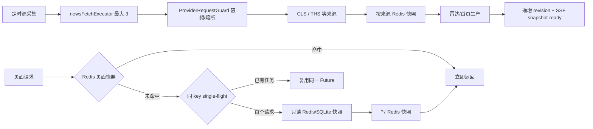

# 实时资讯、雷达与今日热点缓存并发设计

## 目标

在不改变页面接口与热点生产语义的前提下，将 Redis 用作只读快照加速层：实时资讯、研究雷达和首页“今日热点”优先返回最近一次成功结果；缓存失效、Redis 故障或缓存内容损坏时自动回退现有 SQLite 主链路。页面请求绝不直接触发外部抓取。

目标体验为：常规页面读取不再重复执行 SQLite 视图拼装与历史分类；定时生产在后台进行；单次多源资讯抓取由“所有来源串行等待”改为“不同来源受控并发”；生产完成后的版本变化通过 SSE 立即通知可见页面，SSE 断开时才以轻量 revision 轮询降级。

## 已确认现状

- Redis 已启用且可连接。现有 `ResearchMaterialGateway` 已缓存原始 `NEWS_FLASH` 聚合结果，TTL 为 240 秒；这会让 45 秒一次的前端轮询连续命中旧资讯，不能作为实时刷新机制。
- `/api/news` 仍需在每次读取时去重、查分类并组装 `NewsFeedSnapshot`。
- `/api/research-radar?refresh=false` 每次读取都会查询排序事件并构造工作台摘要；`cardIndex` 还可能执行已读状态协调与通知创建。
- `/api/dashboard` 每次读取都会执行来源、文章、简报、抓取批次查询；`DashboardHotspotRankingService` 还会遍历历史雷达事件并写回分类。
- `ResearchMaterialGateway.fetch` 按来源顺序串行抓取。`ProviderRequestGuard` 已是线程安全的，并且会按端点和 provider family 限频、熔断；因此可以安全地让不同来源并发，但不能绕过 Guard。
- 雷达已有单飞后台生产锁（`AtomicBoolean running`）和单线程 `radarRefreshExecutor`；它保证 SQLite 的持久化链路不发生并发写竞争，应保留。

## 方案选择

采用“定时源快照生产 + Redis 成品快照 + 版本通知 + 来源受控并发”的组合方案。

不采用只增加 Redis TTL 的方案：它已覆盖外部资料，但不能消除雷达/首页的重复视图读取与分类写入，并且 240 秒 TTL 会损害实时性。

不采用雷达事件并行写 SQLite 的方案：SQLite 单写入模型下收益有限且会引入锁等待、半状态与排序不稳定风险。

不引入 Redis 分布式锁：当前是单后端实例，进程内 single-flight 足以抑制缓存击穿；Redis 只保存数据和版本号。未来多实例部署时再以 `SET NX PX` 替换该锁，不改变 key 结构。

## 缓存边界

| 读取面 | Redis 值 | 键组成 | TTL | 立即失效 |
| --- | --- | --- | --- | --- |
| 实时资讯 `/api/news` | `NewsFeedSnapshot` JSON | category + limit + `news-view` 版本 | 30 秒 | 定时源快照完成、分类人工复核、新闻分类后台任务完成 |
| 雷达 `/api/research-radar` | `ResearchRadarView` JSON | category + watchlistOnly + limit + state + `radar-view` 版本 | 60 秒 | 雷达批次成功完成、事件状态/观察/研究关联/解读更新 |
| 首页 `/api/dashboard` | Dashboard summary JSON | `dashboard-view` 版本 | 30 秒 | 雷达批次成功完成；其他首页数据最多自然延迟 30 秒 |

每个源另有 `finscope:news-source:{provider}` 快照，内容含该源材料、告警和 `fetchedAt`。采集成功时只覆盖该来源，失败时保留该来源上一份成功快照并记录告警。版本号以 Redis `INCR` 保存；实际页面快照键包含版本号。失效只递增版本号，不使用 `KEYS` 或全量 `SCAN` 删除。旧键由 TTL 自动回收。

序列化失败、Redis 连接失败、缓存 JSON 无法反序列化时视为未命中；记录脱敏告警并继续原主链路。空的或降级抓取结果不写入资讯抓取缓存，避免把故障短路扩大为页面空白。

## 并发模型

### 来源抓取

- 新增独立 `newsFetchExecutor`：核心/最大线程数 3、队列 6、线程名前缀 `news-fetch-`；`NewsSourceRefreshScheduler` 每 30 秒请求一次单飞采集。
- 每个健康 `ResearchMaterialProvider` 提交一个 `CompletableFuture`；最多 3 个任务同跑。`ProviderRequestGuard.execute` 仍包裹每次调用，因此同一来源家族（例如 THS）会按已有 family throttle 排队，不会被并发击穿。
- 结果按 `ProviderRoutePolicy.orderExternal` 的顺序合并，而非完成顺序，保持同分去重的确定性。每个来源的异常转为该来源 warning，其它来源仍可保留上一份成功快照。
- 每个源刷新周期由 `ConcurrentHashMap<String, CompletableFuture<...>>` single-flight 管理；同一周期不会叠加第二组外部 fan-out。页面缓存未命中只读最近源快照，不参与该 single-flight。

### 不并发的部分

- 雷达 `FETCH(读取本地源快照) -> NORMALIZE -> AGGREGATE -> RANK -> PERSIST` 保持批次内部顺序；尤其 `PERSIST` 保持单线程和现有事务边界。源快照批次成功后请求一次雷达生产；保留已有五分钟定时生产作为兜底。
- 雷达增强/解读沿用已有独立执行器及当前数量上限，不把 LLM 调用并入页面请求。
- 首页分类修正从 `DashboardHotspotRankingService.rankings()` 移到雷达生产完成后的后处理，读取接口只读缓存或查询，不做写入。

## 失效事件

1. 每轮源采集完成后递增资讯版本，并请求一次雷达生产。
2. `RadarHotspotProductionPipeline` 成功持久化并完成批次后，递增雷达和首页版本号。
3. 事件状态、观察、研究关联、解读状态变化后，递增雷达版本号。
4. 分类人工复核与异步分类批量落库后，递增实时资讯版本号。
5. 每次版本递增后发出一个只含 `scope`、`revision`、`completedAt` 的 SSE `snapshot-ready` 事件；前端收到后再读取相应完整快照。SSE 连接中断时，每 5 秒只读取 revision，不盲拉全量。
6. Redis 失效事件本身不阻塞业务；TTL 是所有主动失效的兜底。

## 可观测性与验收

- 为页面缓存和抓取 single-flight 记录命中、未命中、共享等待、写入失败、来源耗时和总耗时；日志不打印缓存 payload、URL 参数中的敏感数据或凭据。
- 首次冷读可正常完成；热读不访问 Provider。
- 并发 10 个相同页面请求时，不发生 Provider 调用；同一时刻触发的两个源刷新请求只发生一组按来源 fan-out 的 Provider 调用。
- Redis 停止后，三接口仍返回 200 且走现有回退逻辑。
- 批次成功后，旧雷达和首页热点快照不再被读取；事件状态变化后旧雷达快照不再被读取；可见页面在收到 SSE 后立即重读新版本。
