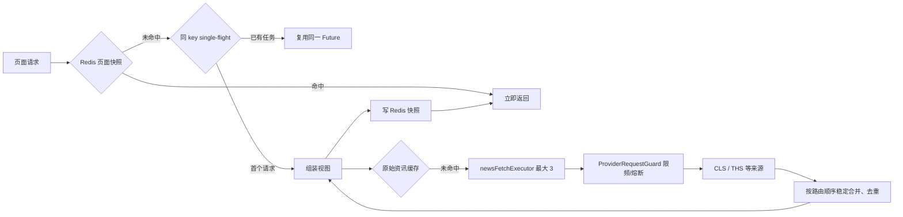

# 实时资讯、雷达与今日热点缓存并发设计

## 目标

在不改变页面接口与热点生产语义的前提下，将 Redis 用作只读快照加速层：实时资讯、研究雷达和首页“今日热点”优先返回最近一次成功结果；缓存失效、Redis 故障或缓存内容损坏时自动回退现有 SQLite/抓取主链路。

目标体验为：常规页面读取不再重复执行 SQLite 视图拼装与历史分类；雷达生产仍在后台进行；单次多源资讯抓取由“所有来源串行等待”改为“不同来源受控并发”。

## 已确认现状

- Redis 已启用且可连接。现有 `ResearchMaterialGateway` 已缓存原始 `NEWS_FLASH` 聚合结果，TTL 为 240 秒。
- `/api/news` 仍需在每次读取时去重、查分类并组装 `NewsFeedSnapshot`。
- `/api/research-radar?refresh=false` 每次读取都会查询排序事件并构造工作台摘要；`cardIndex` 还可能执行已读状态协调与通知创建。
- `/api/dashboard` 每次读取都会执行来源、文章、简报、抓取批次查询；`DashboardHotspotRankingService` 还会遍历历史雷达事件并写回分类。
- `ResearchMaterialGateway.fetch` 按来源顺序串行抓取。`ProviderRequestGuard` 已是线程安全的，并且会按端点和 provider family 限频、熔断；因此可以安全地让不同来源并发，但不能绕过 Guard。
- 雷达已有单飞后台生产锁（`AtomicBoolean running`）和单线程 `radarRefreshExecutor`；它保证 SQLite 的持久化链路不发生并发写竞争，应保留。

## 方案选择

采用“Redis 页面快照 + 抓取层单飞 + 来源受控并发”的组合方案。

不采用只增加 Redis TTL 的方案：它已覆盖外部资料，但不能消除雷达/首页的重复视图读取与分类写入。

不采用雷达事件并行写 SQLite 的方案：SQLite 单写入模型下收益有限且会引入锁等待、半状态与排序不稳定风险。

不引入 Redis 分布式锁：当前是单后端实例，进程内 single-flight 足以抑制缓存击穿；Redis 只保存数据和版本号。未来多实例部署时再以 `SET NX PX` 替换该锁，不改变 key 结构。

## 缓存边界

| 读取面 | Redis 值 | 键组成 | TTL | 立即失效 |
| --- | --- | --- | --- | --- |
| 实时资讯 `/api/news` | `NewsFeedSnapshot` JSON | category + limit + `news-view` 版本 | 30 秒 | 分类人工复核、新闻分类后台任务完成 |
| 雷达 `/api/research-radar` | `ResearchRadarView` JSON | category + watchlistOnly + limit + state + `radar-view` 版本 | 60 秒 | 雷达批次成功完成、事件状态/观察/研究关联/解读更新 |
| 首页 `/api/dashboard` | Dashboard summary JSON | `dashboard-view` 版本 | 30 秒 | 雷达批次成功完成；其他首页数据最多自然延迟 30 秒 |

版本号以 Redis `INCR` 保存；实际快照键包含版本号。失效只递增版本号，不使用 `KEYS` 或全量 `SCAN` 删除。旧键由 TTL 自动回收。

序列化失败、Redis 连接失败、缓存 JSON 无法反序列化时视为未命中；记录脱敏告警并继续原主链路。空的或降级抓取结果不写入资讯抓取缓存，避免把故障短路扩大为页面空白。

## 并发模型

### 来源抓取

- 新增独立 `newsFetchExecutor`：核心/最大线程数 3、队列 6、线程名前缀 `news-fetch-`。
- 每个健康 `ResearchMaterialProvider` 提交一个 `CompletableFuture`；最多 3 个任务同跑。`ProviderRequestGuard.execute` 仍包裹每次调用，因此同一来源家族（例如 THS）会按已有 family throttle 排队，不会被并发击穿。
- 结果按 `ProviderRoutePolicy.orderExternal` 的顺序合并，而非完成顺序，保持同分去重的确定性。每个来源的异常转为该来源 warning，其它来源仍可返回。
- 每个 `cacheKey` 由 `ConcurrentHashMap<String, CompletableFuture<ResearchMaterialGatewayResult>>` single-flight 管理：并发未命中仅有一个外部 fan-out。Future 无论成功/失败都在 `whenComplete` 移除。

### 不并发的部分

- 雷达 `FETCH -> NORMALIZE -> AGGREGATE -> RANK -> PERSIST` 保持批次内部顺序；尤其 `PERSIST` 保持单线程和现有事务边界。
- 雷达增强/解读沿用已有独立执行器及当前数量上限，不把 LLM 调用并入页面请求。
- 首页分类修正从 `DashboardHotspotRankingService.rankings()` 移到雷达生产完成后的后处理，读取接口只读缓存或查询，不做写入。

## 失效事件

1. `RadarHotspotProductionPipeline` 成功持久化并完成批次后，递增雷达和首页版本号。
2. 事件状态、观察、研究关联、解读状态变化后，递增雷达版本号。
3. 分类人工复核与异步分类批量落库后，递增实时资讯版本号。
4. Redis 失效事件本身不阻塞业务；TTL 是所有主动失效的兜底。

## 可观测性与验收

- 为页面缓存和抓取 single-flight 记录命中、未命中、共享等待、写入失败、来源耗时和总耗时；日志不打印缓存 payload、URL 参数中的敏感数据或凭据。
- 首次冷读可正常完成；热读不访问 Provider。
- 并发 10 个相同资讯请求时，只发生一组按来源 fan-out 的 Provider 调用。
- Redis 停止后，三接口仍返回 200 且走现有回退逻辑。
- 批次成功后，旧雷达和首页热点快照不再被读取；事件状态变化后旧雷达快照不再被读取。
