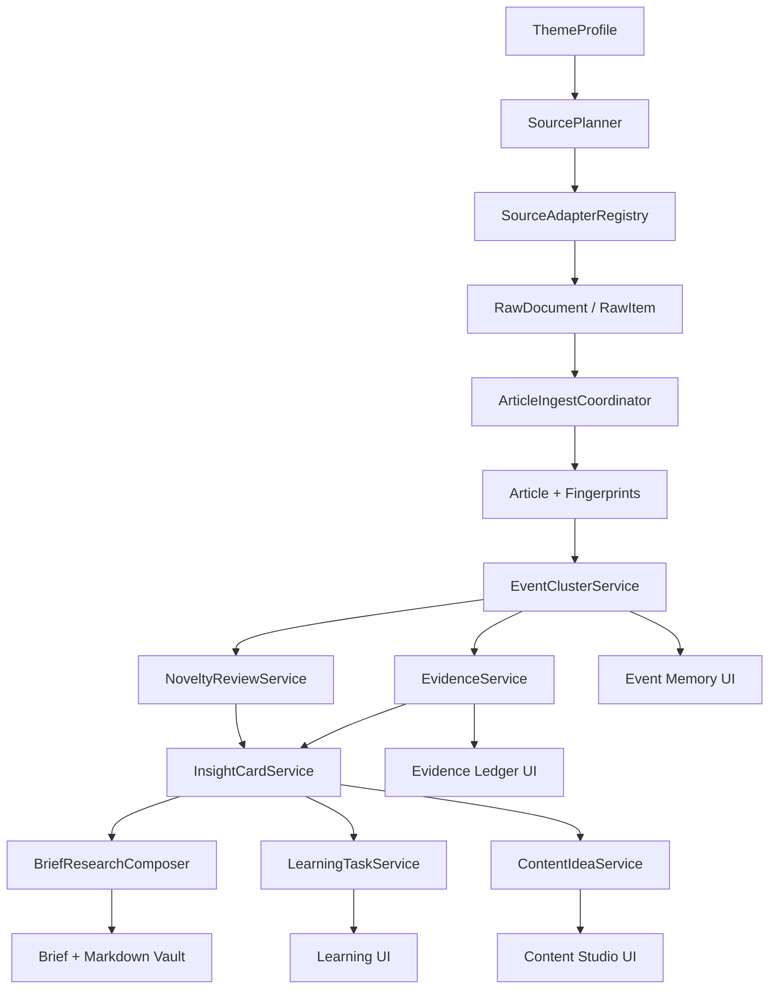

# TRD：FinScope 事件驱动金融研究系统

## 1. 文档信息

- 项目名称：FinScope
- 文档类型：Technical Requirements Document
- 目标版本：V4.5 / V5 前置版本
- 文档状态：Draft
- 目标用户：个人金融学习者、投研信息整理者、自媒体内容创作者、求职项目展示者

## 2. 背景与问题

FinScope 当前已经具备信息源、Inbox、文章去重、新意判断、情报卡片、每日简报、主题沉淀和学习笔记等能力。但现阶段仍然以“文章”为主要处理对象，存在三个关键瓶颈：

1. 跨天重复仍可能出现：同一事件被不同媒体、不同来源或隔天跟进报道时，系统容易把它当作新文章再次写进简报。
2. 解读流程扩展有限：文章解读、主题沉淀、简报生成仍偏线性，缺少事件记忆、证据链、学习路径和内容选题之间的明确工程接口。
3. 项目差异化需要进一步强化：FinScope 不应成为另一个热点聚合工具，而应成为“有记忆的金融研究与内容生产系统”。

本 TRD 目标是把 FinScope 升级为事件驱动系统：

```text

主题策略
  -> 来源组合
  -> 抓取与标准化
  -> 事件归并
  -> 新变量判断
  -> 证据账本
  -> 金融/创业/学习解读
  -> 每日简报
  -> 学习任务与自媒体选题

```

## 3. 产品定位

FinScope 的定位不是“热点榜单”，而是：

> 面向金融学习与自媒体创作的事件研究系统。

它和 data-hotspot 或普通资讯聚合产品的差异如下：

| 维度 | data-hotspot / 热点聚合 | FinScope |
| --- | --- | --- |
| 关注对象 | 热度、趋势、榜单 | 事件、新变量、证据、学习价值 |
| 处理单位 | 话题/新闻/内容条目 | 事件簇 EventCluster |
| 核心目标 | 发现大家正在关注什么 | 判断哪些变量真的改变 |
| 时间维度 | 当前热度 | 首次出现、后续进展、长期跟踪 |
| 输出 | 热点列表、运营视图 | 简报、证据链、学习问题、内容选题 |
| 价值主张 | 快速发现热点 | 把信息转化为金融理解和创作素材 |

## 4. 目标与非目标

### 4.1 目标

1. 建立事件级记忆，避免同一事件跨天重复进入简报。
2. 建立证据账本，让每个重要结论都能回溯到来源、事实和置信度。
3. 建立主题化来源策略，不再固定抓同一批网站，而是按主题组合来源。
4. 建立“学习与创作桥接”，把事件转化为学习问题、金融概念和自媒体选题。
5. 保持代码高级简约：模块清晰、接口稳定、可测试、不过度工程化。
6. 保持本地优先：SQLite + Markdown Vault 仍是第一阶段主存储。

### 4.2 非目标

1. 不做公开投资建议或买卖信号。
2. 不做公共热点排行榜。
3. 不做企业运营后台、发布链路或内容审核系统。
4. 第一版不引入复杂向量数据库、消息队列、分布式调度或云端多租户。
5. 第一版不追求覆盖几十个来源，优先打通稳定闭环。
6. 第一版不依赖 Codex 生成简报；Codex 只作为开发工具，不作为运行时能力。

## 5. 核心设计原则

### 5.1 事件优先，而不是文章优先

文章只是证据载体。系统真正要追踪的是事件。

```text
Article A: Reuters 报道美联储措辞变化
Article B: CNBC 报道市场反应
Article C: Fed 官方声明

=> EventCluster: 美联储释放更偏鹰/偏鸽信号
```

### 5.2 官方来源定事实，媒体来源看解释

系统对来源做分层：

```text
OFFICIAL / REGULATOR / COMPANY：事实底座
DATA_PROVIDER：宏观和市场数据
MEDIA：解释和市场反应
CURATED_AI：AI 创业精选线索
SOCIAL_OFFICIAL：官方账号线索
SOCIAL_OTHER：默认低权重，仅作为线索
```

### 5.3 LLM 只做受控认知任务

LLM 可以参与摘要、事实抽取、学习问题生成、选题角度生成，但不能控制抓取、去重、事件归并和是否入库。所有 LLM 输出必须落成结构化 JSON，并经过字段校验和兜底逻辑。

### 5.4 第一版坚持模块化单体

继续沿用现有 Maven 多模块：

```text
finscope-web
  -> finscope-service
      -> finscope-dao
      -> finscope-rpc
  -> finscope-domain
```

新增能力按现有分层落位，不引入横向复杂度。

## 6. 核心领域模型

### 6.1 ThemeProfile：主题画像

描述一个研究主题如何抓取、筛选、解读和生成内容。

示例：

```yaml
code: ai_startup
name: AI 创业
description: AI 产品、融资、模型发布、开发者生态和创业公司动态
briefSection: AI/科技创业
sourcePolicy:
  requiredTiers: [CURATED_AI, COMPANY]
  preferredTiers: [MEDIA, SOCIAL_OFFICIAL]
  disallowedTiers: [SOCIAL_OTHER]
noveltyPolicy:
  minImportance: 60
  includeFollowUp: true
creatorPolicy:
  enabled: true
  preferredFormats: [LONG_ARTICLE, SHORT_VIDEO, PODCAST]
```

第一版内置三个主题：

1. `ai_startup`：AI 创业
2. `china_macro`：中国宏观
3. `company_ipo`：公司 / IPO

### 6.2 SourceProfile：来源画像

描述一个来源的类型、可信度、适配器和适用主题。

关键字段：

```text
id
name
url
sourceTier
adapterType
themes
credibility
fetchFrequencyMinutes
enabled
notes
```

示例：

```yaml
name: HKEXnews
sourceTier: REGULATOR
adapterType: WEB
themes: [company_ipo]
credibility: 5
```

### 6.3 RawDocument：原始文档

外部来源抓取后的原始内容。第一版可以复用现有 `RawItem`，后续如需保留完整 HTML、HTTP 元信息、抓取快照，再落为独立表。

关键字段：

```text
sourceId
sourceName
title
url
publishedAt
summary
body
contentType
extractionMethod
qualityScore
fetchedAt
```

### 6.4 Article：标准化文章

现有 `article` 表继续保留。它是系统处理的标准化内容载体，包含 URL 指纹、标题指纹、正文 SimHash 和新意判断。

需要新增或补强字段：

```text
source_tier
theme_code
canonical_event_key
importance_score
```

第一版如不想改动太大，可以先把 `source_tier` 和 `theme_code` 放在新关联表中。

### 6.5 EventCluster：事件簇

事件记忆系统的核心。

一个事件簇代表“同一件事”的持续生命周期。

关键字段：

```text
id
canonical_title
canonical_event_key
theme_code
summary
status
first_seen_at
last_seen_at
last_meaningful_update_at
importance_score
novelty_state
evidence_count
article_count
created_at
updated_at
```

状态枚举：

```text
ACTIVE：仍在追踪
COOLING：热度下降但近期有价值
ARCHIVED：归档，不再进入每日简报
```

### 6.6 EventArticleLink：事件与文章关系

一个事件可关联多篇文章，一篇文章通常只归属一个主事件。

关键字段：

```text
event_id
article_id
relation_type
match_score
novelty_type
novelty_reason
created_at
```

关系类型：

```text
PRIMARY：主证据
SUPPORTING：补充证据
MARKET_REACTION：市场反应
BACKGROUND：背景材料
```

新意类型：

```text
NEW：新事件
FOLLOW_UP：旧事件新进展
RECAP：旧事件复述
DUPLICATE：重复报道
NOISE：低价值噪音
```

### 6.7 EvidenceItem：证据项

从文章、公告、数据源中提取出的可引用事实。

关键字段：

```text
id
event_id
article_id
source_name
source_url
source_tier
evidence_type
claim
value
unit
occurred_at
confidence
importance
quote
created_at
```

证据类型：

```text
FACT：事实陈述
DATA：数据
TIMELINE：时间线
PARTY：相关方
GUIDANCE：公司/机构指引
MARKET_REACTION：市场反应
RISK：风险点
UNKNOWN：未分类
```

### 6.8 InsightCard：解读卡片

现有 `insight_card` 继续作为文章级或事件级解读资产。升级后建议逐步从“文章卡片”演进为“事件卡片”。

第一版兼容策略：

1. 保留 `article_id` 字段。
2. 新增可选 `event_id` 字段。
3. Brief 优先消费事件级 InsightCard；没有事件卡片时消费文章卡片。

### 6.9 LearningTask：学习任务

从事件中提炼用户需要补充的金融知识。

关键字段：

```text
id
event_id
theme_code
question
concepts
difficulty
status
why_needed
created_at
updated_at
```

状态：

```text
TODO
LEARNING
REVIEWING
DONE
```

### 6.10 ContentIdea：自媒体选题

把事件转化为内容创作资产。

关键字段：

```text
id
event_id
theme_code
title
angle
format
audience
score
score_reason
outline
status
created_at
updated_at
```

格式枚举：

```text
LONG_ARTICLE
SHORT_VIDEO
PODCAST
X_THREAD
XIAOHONGSHU_NOTE
```

状态：

```text
IDEA
DRAFTING
READY
PUBLISHED
ARCHIVED
```

## 7. 系统架构



### 7.1 后端包结构

建议新增包：

```text
backend/finscope-domain/src/main/java/com/finscope/domain/research/
  ThemeProfile.java
  SourceTier.java
  EventCluster.java
  EventArticleLink.java
  EvidenceItem.java
  LearningTask.java
  ContentIdea.java
  ResearchRun.java

backend/finscope-dao/src/main/java/com/finscope/dao/research/
  EventClusterRepository.java
  EvidenceItemRepository.java
  LearningTaskRepository.java
  ContentIdeaRepository.java
  ResearchRunRepository.java

backend/finscope-service/src/main/java/com/finscope/service/research/
  ThemeProfileService.java
  SourcePlanner.java
  EventClusterService.java
  EvidenceService.java
  NoveltyReviewService.java
  LearningTaskService.java
  ContentIdeaService.java
  ResearchBriefComposer.java

backend/finscope-web/src/main/java/com/finscope/web/controller/
  ResearchController.java
  EventController.java
  EvidenceController.java
  ContentIdeaController.java
```

### 7.2 代码约束

1. Controller 不直接访问 Repository。
2. Service 负责用例编排，算法逻辑拆到小类。
3. Repository 只做 SQL 和 RowMapper，不做业务判断。
4. LLM 调用只出现在 Agent 或 Interpreter 类，不出现在 Controller / Repository。
5. 第一版不引入泛型过重的工作流框架，避免为了“Agent 化”牺牲可读性。

## 8. 数据库设计

### 8.1 event_cluster

```sql
CREATE TABLE IF NOT EXISTS event_cluster (
  id INTEGER PRIMARY KEY AUTOINCREMENT,
  canonical_title TEXT NOT NULL,
  canonical_event_key TEXT NOT NULL,
  theme_code TEXT NOT NULL,
  summary TEXT,
  status TEXT NOT NULL,
  first_seen_at TEXT NOT NULL,
  last_seen_at TEXT NOT NULL,
  last_meaningful_update_at TEXT,
  importance_score INTEGER NOT NULL DEFAULT 0,
  novelty_state TEXT NOT NULL,
  evidence_count INTEGER NOT NULL DEFAULT 0,
  article_count INTEGER NOT NULL DEFAULT 0,
  created_at TEXT NOT NULL,
  updated_at TEXT NOT NULL
);

CREATE INDEX IF NOT EXISTS idx_event_cluster_theme ON event_cluster(theme_code);
CREATE INDEX IF NOT EXISTS idx_event_cluster_key ON event_cluster(canonical_event_key);
CREATE INDEX IF NOT EXISTS idx_event_cluster_seen ON event_cluster(last_seen_at);
```

### 8.2 event_article_link

```sql
CREATE TABLE IF NOT EXISTS event_article_link (
  event_id INTEGER NOT NULL,
  article_id INTEGER NOT NULL,
  relation_type TEXT NOT NULL,
  match_score REAL NOT NULL,
  novelty_type TEXT NOT NULL,
  novelty_reason TEXT,
  created_at TEXT NOT NULL,
  PRIMARY KEY(event_id, article_id)
);

CREATE INDEX IF NOT EXISTS idx_event_article_article ON event_article_link(article_id);
CREATE INDEX IF NOT EXISTS idx_event_article_novelty ON event_article_link(novelty_type);
```

### 8.3 evidence_item

```sql
CREATE TABLE IF NOT EXISTS evidence_item (
  id INTEGER PRIMARY KEY AUTOINCREMENT,
  event_id INTEGER NOT NULL,
  article_id INTEGER,
  source_name TEXT,
  source_url TEXT,
  source_tier TEXT NOT NULL,
  evidence_type TEXT NOT NULL,
  claim TEXT NOT NULL,
  value TEXT,
  unit TEXT,
  occurred_at TEXT,
  confidence INTEGER NOT NULL DEFAULT 60,
  importance INTEGER NOT NULL DEFAULT 50,
  quote TEXT,
  created_at TEXT NOT NULL
);

CREATE INDEX IF NOT EXISTS idx_evidence_event ON evidence_item(event_id);
CREATE INDEX IF NOT EXISTS idx_evidence_type ON evidence_item(evidence_type);
CREATE INDEX IF NOT EXISTS idx_evidence_source_tier ON evidence_item(source_tier);
```

### 8.4 learning_task

```sql
CREATE TABLE IF NOT EXISTS learning_task (
  id INTEGER PRIMARY KEY AUTOINCREMENT,
  event_id INTEGER,
  theme_code TEXT NOT NULL,
  question TEXT NOT NULL,
  concepts TEXT,
  difficulty TEXT NOT NULL,
  status TEXT NOT NULL,
  why_needed TEXT,
  created_at TEXT NOT NULL,
  updated_at TEXT NOT NULL
);

CREATE INDEX IF NOT EXISTS idx_learning_task_event ON learning_task(event_id);
CREATE INDEX IF NOT EXISTS idx_learning_task_status ON learning_task(status);
```

### 8.5 content_idea

```sql
CREATE TABLE IF NOT EXISTS content_idea (
  id INTEGER PRIMARY KEY AUTOINCREMENT,
  event_id INTEGER,
  theme_code TEXT NOT NULL,
  title TEXT NOT NULL,
  angle TEXT,
  format TEXT NOT NULL,
  audience TEXT,
  score INTEGER NOT NULL DEFAULT 0,
  score_reason TEXT,
  outline TEXT,
  status TEXT NOT NULL,
  created_at TEXT NOT NULL,
  updated_at TEXT NOT NULL
);

CREATE INDEX IF NOT EXISTS idx_content_idea_event ON content_idea(event_id);
CREATE INDEX IF NOT EXISTS idx_content_idea_score ON content_idea(score);
CREATE INDEX IF NOT EXISTS idx_content_idea_status ON content_idea(status);
```

### 8.6 research_run

```sql
CREATE TABLE IF NOT EXISTS research_run (
  id INTEGER PRIMARY KEY AUTOINCREMENT,
  run_date TEXT NOT NULL,
  theme_code TEXT,
  status TEXT NOT NULL,
  input TEXT,
  output TEXT,
  error_message TEXT,
  started_at TEXT NOT NULL,
  ended_at TEXT
);

CREATE INDEX IF NOT EXISTS idx_research_run_date ON research_run(run_date);
CREATE INDEX IF NOT EXISTS idx_research_run_theme ON research_run(theme_code);
```

### 8.7 对现有表的最小改造

```sql
ALTER TABLE insight_card ADD COLUMN event_id INTEGER;
ALTER TABLE article ADD COLUMN source_tier TEXT;
ALTER TABLE article ADD COLUMN theme_code TEXT;
ALTER TABLE article ADD COLUMN canonical_event_key TEXT;
ALTER TABLE article ADD COLUMN importance_score INTEGER;
```

兼容原则：

1. 所有新增列都允许为空。
2. 现有文章列表、简报列表、主题列表 API 不因新增字段破坏。
3. 如果旧数据没有事件簇，系统仍可按现有文章级逻辑生成简报。

## 9. 主题化来源策略

### 9.1 SourcePlanner

`SourcePlanner` 接收日期和主题，输出需要抓取的来源列表。

输入：

```text
date
themeCodes
maxSourcesPerTheme
includeDisabled
```

输出：

```text
List<PlannedSource>
```

`PlannedSource` 字段：

```text
sourceId
sourceName
sourceTier
adapterType
themeCode
priority
reason
```

### 9.2 内置主题策略

#### AI 创业

目标：发现 AI 产品、融资、模型发布、开发者生态、开源工具和创业公司变化。

来源层级：

```text
CURATED_AI：AI HOT
COMPANY：OpenAI、Anthropic、Google Blog、Runway、公司博客
MEDIA：TechCrunch、The Verge
SOCIAL_OFFICIAL：官方 X/GitHub Releases
```

入选规则：

1. 产品发布、融资、开源 release 优先。
2. 纯观点文章降权。
3. 非官方社交爆料默认不进简报，只进线索池。

#### 中国宏观

目标：学习政策、经济数据、货币信用、地产、财政和监管变量。

来源层级：

```text
OFFICIAL：央行、国家统计局、中国政府网
REGULATOR：交易所、监管机构
MEDIA：Reuters、财新、证券时报、上证报
```

入选规则：

1. 官方数据和政策原文优先。
2. 媒体用于解释市场反应。
3. 没有新数据、新措辞或新政策时不重复写。

#### 公司 / IPO

目标：跟踪公司财报、招股书、IPO、重大交易和市场反应。

来源层级：

```text
COMPANY：公司 IR、新闻稿
REGULATOR：SEC、HKEXnews、交易所公告
MEDIA：Reuters、Bloomberg、FT、WSJ
```

入选规则：

1. 财报、招股书、公告是事实底座。
2. 媒体补充市场反应、估值和投资者反馈。
3. 重复转载不生成新事件。

## 10. 事件归并算法

### 10.1 输入

事件归并输入是标准化后的 `Article`。

需要字段：

```text
title
url
sourceName
sourceTier
publishedAt
summary
body
category/theme
urlFingerprint
titleFingerprint
bodySimhash
```

### 10.2 候选事件召回

从 `event_cluster` 中召回候选：

1. 同主题最近 30 天事件。
2. `canonical_event_key` 相同或相近。
3. 标题关键词重叠。
4. 关联实体重叠。
5. 如果是公司/IPO，优先按公司名、ticker、交易所代码召回。

第一版不用向量检索，使用 SQLite + 确定性规则：

```text
WHERE theme_code = ?
  AND last_seen_at >= date.minusDays(30)
  AND (
    canonical_event_key = ?
    OR canonical_title LIKE ?
    OR summary LIKE ?
  )
```

### 10.3 匹配分数

对每个候选事件计算 `matchScore`：

```text
matchScore =
  0.30 * titleSimilarity
+ 0.20 * entityOverlap
+ 0.20 * bodySimilarity
+ 0.20 * eventKeySimilarity
+ 0.10 * timeProximity
```

说明：

```text
titleSimilarity：标题 token Jaccard 或现有 FingerprintService 相似度
entityOverlap：公司、人名、机构、产品、地区、指标名重叠
bodySimilarity：SimHash 距离转换为 0-1
eventKeySimilarity：canonical_event_key 是否相同或近似
timeProximity：越近越高，超过 30 天显著衰减
```

阈值：

```text
>= 0.82：归入同一事件
0.65 - 0.82：疑似同一事件，按 FOLLOW_UP / RECAP 规则判断
< 0.65：新建事件
```

### 10.4 canonical_event_key

第一版使用确定性生成：

```text
themeCode + normalizedEntities + normalizedAction + normalizedObject
```

示例：

```text
china_macro:pboc:rate_cut:mlf
company_ipo:hkex:ipo:company_name
ai_startup:openai:product_launch:model_name
```

若实体抽取不足，则回退到标题关键词。

### 10.5 新意判断

归并到事件后，判断文章对事件的贡献：

```text
NEW：
  没有匹配事件，创建新事件。

FOLLOW_UP：
  匹配旧事件，但带来新事实、新数据、新公告、新时间线、新市场反应。

RECAP：
  匹配旧事件，只是背景复述或观点重复。

DUPLICATE：
  URL、标题或正文高度相似。

NOISE：
  低质量、无正文、营销、重复转载、来源不可信。
```

FOLLOW_UP 判断规则：

```text
hasNewOfficialEvidence
OR hasNewNumericalData
OR hasNewGuidance
OR hasNewTimelineEvent
OR hasMeaningfulMarketReaction
```

## 11. 证据账本设计

### 11.1 EvidenceService

`EvidenceService` 负责从文章和事件中生成证据项。

第一版采用规则 + 兜底方式：

1. 官方/公司/监管来源的标题和摘要可生成 `FACT`。
2. 包含百分比、金额、日期、同比、环比、指引等文本时生成 `DATA` 或 `GUIDANCE`。
3. 包含“宣布、发布、提交、批准、上市、融资、降息、上调、下调”等动作词时生成 `TIMELINE`。
4. LLM 可用于把长文本拆成结构化证据，但必须校验 `claim` 非空、`source_url` 存在、`confidence` 合法。

### 11.2 置信度规则

```text
OFFICIAL / REGULATOR：默认 90
COMPANY：默认 85
DATA_PROVIDER：默认 85
MEDIA：默认 70
CURATED_AI：默认 65
SOCIAL_OFFICIAL：默认 60
SOCIAL_OTHER：默认 35
```

置信度不是“真实性证明”，而是系统用于排序、展示和生成简报时的权重。

### 11.3 证据在简报中的使用

每日简报每个重要事件至少需要：

1. 一个主证据。
2. 一个事实来源。
3. 如果是市场反应类判断，需要至少一个媒体或市场数据来源。

如果证据不足，简报中要明确写：

```text
证据不足：目前只有社交平台线索，尚未找到官方或主流媒体交叉验证。
```

## 12. 学习与创作桥接

### 12.1 LearningTask 生成

对每个高价值事件生成 1-3 个学习任务。

生成规则：

```text
宏观事件 -> 宏观指标、政策工具、传导机制
公司/IPO -> 商业模式、财务指标、估值、招股书术语
AI 创业 -> 产品形态、技术栈、商业化、开发者生态
```

示例：

```text
事件：核心 PCE 低于预期
学习任务：
  - PCE 和 CPI 有什么区别？
  - 为什么核心 PCE 会影响美联储利率预期？
  - 利率预期如何影响黄金和成长股估值？
```

### 12.2 ContentIdea 生成

选题不是“标题党生成器”，而是把事件转成有教育价值的内容角度。

评分维度：

```text
understandability：普通人可理解度
knowledgeDensity：金融知识密度
timeliness：时效性
longTailValue：长期价值
personalFit：是否符合用户金融学习/自媒体定位
evidenceStrength：证据强度
```

总分：

```text
score =
  0.20 * understandability
+ 0.20 * knowledgeDensity
+ 0.15 * timeliness
+ 0.20 * longTailValue
+ 0.15 * personalFit
+ 0.10 * evidenceStrength
```

输出示例：

```text
标题：为什么市场还没等到降息，黄金已经先涨了？
角度：解释预期差、实际利率和资产定价。
格式：LONG_ARTICLE
受众：想学习宏观投资的新手
大纲：
  1. 降息还没发生，市场为什么先反应？
  2. 实际利率如何影响黄金？
  3. 投资里为什么要看预期差？
```

## 13. 简报生成升级

### 13.1 新简报输入

简报不再直接消费松散文章，而是消费：

```text
List<EventCluster>
List<EvidenceItem>
List<InsightCard>
List<LearningTask>
List<ContentIdea>
```

### 13.2 入选规则

进入每日简报的事件必须满足：

```text
noveltyType in [NEW, FOLLOW_UP]
AND importanceScore >= 60
AND evidenceCount >= 1
```

特殊情况：

```text
如果是高价值学习材料，但不是新事件，可以进入“学习材料”区，不进入“今日事件”区。
```

### 13.3 简报结构

建议 Markdown 结构：

```markdown
# 每日金融、投资、创业学习简报 - YYYY-MM-DD

生成时间：...
定位：帮助建立长期判断力，不提供具体买卖建议。

## 今日新变量

## 事件追踪

## 中国宏观

## 公司与 IPO

## AI 创业

## 今日证据来源

## 今天要补的金融知识

## 可发展为自媒体选题

## 今日思考题
```

### 13.4 防重复机制

简报生成前读取过去 7 天简报和事件簇：

1. 如果事件在过去 3 天已作为 `NEW` 写过，今天只能作为 `FOLLOW_UP` 出现。
2. 如果今天没有新证据，不能重复写正文，只在“持续跟踪”里一句话标记。
3. 同一事件一周内最多完整展开两次。
4. `RECAP` 和 `DUPLICATE` 不进入正文。

## 14. 后端 API 设计

### 14.1 Research

```text
POST /api/research-runs
GET  /api/research-runs
GET  /api/research-runs/{id}
```

`POST /api/research-runs` 请求：

```json
{
  "date": "2026-06-27",
  "themeCodes": ["ai_startup", "china_macro", "company_ipo"],
  "mode": "MANUAL"
}
```

响应：

```json
{
  "id": 1,
  "runDate": "2026-06-27",
  "status": "SUCCESS",
  "output": "events=5 evidence=14 ideas=3"
}
```

### 14.2 Events

```text
GET /api/events
GET /api/events/{id}
GET /api/events/{id}/evidence
GET /api/events/{id}/articles
```

查询参数：

```text
themeCode
status
noveltyState
dateFrom
dateTo
```

### 14.3 Evidence

```text
GET /api/evidence
GET /api/evidence/{id}
```

查询参数：

```text
eventId
sourceTier
evidenceType
minConfidence
```

### 14.4 Learning

```text
GET  /api/learning-tasks
POST /api/learning-tasks/{id}/status
```

### 14.5 Content Ideas

```text
GET  /api/content-ideas
GET  /api/content-ideas/{id}
POST /api/content-ideas/{id}/status
```

### 14.6 Brief Context

```text
GET /api/briefs/{date}/research-context
```

返回简报对应的事件、证据、学习任务和选题。

## 15. 前端页面设计

### 15.1 Events：事件记忆

核心能力：

1. 展示事件簇列表。
2. 展示 `NEW / FOLLOW_UP / RECAP / DUPLICATE` 分布。
3. 点击事件查看时间线、关联文章、证据和解读。

卡片字段：

```text
事件标题
主题
状态
首次出现
最近更新
重要性分数
证据数量
文章数量
最新新意判断
```

### 15.2 Evidence Ledger：证据账本

核心能力：

1. 按事件查看证据。
2. 按来源层级过滤。
3. 展示事实、数据、时间线、市场反应。

### 15.3 Brief Reader 增强

现有高级简报阅读页继续保留，新增：

1. 大纲概览。
2. 今日新变量。
3. 来源与证据面板。
4. 学习任务。
5. 自媒体选题。

### 15.4 Learning 增强

现有 Learning 页面增加：

1. 自动学习任务队列。
2. 按主题筛选。
3. 任务状态流转。
4. 关联事件入口。

### 15.5 Content Studio

新增内容工作室：

1. 选题列表。
2. 选题评分。
3. 适合形式。
4. 大纲预览。
5. 状态管理。

第一版只做选题池和详情，不做发布、不做复杂编辑器。

## 16. LLM 使用边界

### 16.1 允许 LLM 做的事

1. 从文章中抽取候选事实。
2. 为事件生成一句话摘要。
3. 生成学习问题。
4. 生成内容选题角度。
5. 把证据组织成可读解读。

### 16.2 不允许 LLM 做的事

1. 决定是否抓取来源。
2. 直接决定数据库主键或事件归属。
3. 在没有来源证据时编造事实。
4. 输出投资建议或买卖建议。
5. 跳过结构化 JSON 直接写入数据库。

### 16.3 结构化输出校验

所有 LLM 输出必须：

1. 是合法 JSON。
2. 字段缺失时使用确定性兜底。
3. URL 和 source 必须来自输入证据，不能由模型生成。
4. confidence 必须在 0-100。
5. 如果输出为空，记录 `agent_run` 失败并继续主流程。

## 17. 运行流程

### 17.1 手动研究运行

```text
用户点击“生成今日研究”
  -> ResearchController
  -> ResearchRunService.start(date, themes)
  -> SourcePlanner
  -> FetchService
  -> ArticleIngestCoordinator
  -> EventClusterService
  -> EvidenceService
  -> InsightCardService
  -> LearningTaskService
  -> ContentIdeaService
  -> BriefService.generate(date)
  -> ResearchRunRepository.record()
```

### 17.2 兼容现有简报生成

`POST /api/briefs/generate` 保留现有行为，但内部优先读取事件研究结果：

1. 如果当天有 EventCluster 和 EvidenceItem，生成研究型简报。
2. 如果没有事件研究结果，回退到现有文章/情报卡片简报。

## 18. 测试方案

### 18.1 单元测试

新增测试：

```text
EventClusterServiceTest
  - 新文章没有候选事件时创建 NEW 事件
  - 同标题/同正文相似文章归为 DUPLICATE
  - 同事件但包含新数据时标记 FOLLOW_UP
  - 旧事件复述标记 RECAP

EvidenceServiceTest
  - 官方来源生成高置信度 FACT
  - 包含百分比/金额生成 DATA
  - 社交非官方来源置信度较低

ContentIdeaServiceTest
  - 高证据强度事件生成高分选题
  - 低质量事件不生成选题

LearningTaskServiceTest
  - 宏观事件生成概念学习问题
  - IPO 事件生成商业模式/财务指标问题
```

### 18.2 API 集成测试

扩展 `FinScopeApiIntegrationTest`：

1. 抓取两篇同事件文章，只生成一个 EventCluster。
2. 第二篇带新数据时，事件关系为 FOLLOW_UP。
3. `GET /api/events` 返回事件列表。
4. `GET /api/events/{id}/evidence` 返回证据。
5. `GET /api/content-ideas` 返回选题。
6. 生成简报时包含“今日新变量”和“今日证据来源”。

### 18.3 前端测试

扩展 `App.test.tsx`：

1. Events 页面展示事件标题、主题、证据数量。
2. Evidence Ledger 展示来源层级和证据类型。
3. Brief Reader 显示来源与证据面板。
4. Content Studio 展示选题评分和大纲。
5. Learning 页面展示自动学习任务。

### 18.4 构建验证

每次实现阶段至少运行：

```bash
cd frontend && npm test
cd frontend && npm run build
cd backend/finscope-web && mvn -nsu -Dtest=FinScopeApiIntegrationTest test
```

全量后端测试在清理现有无关测试问题后运行：

```bash
cd backend && mvn test
```

## 19. 分阶段实现路线

### Phase 1：事件记忆 MVP

目标：解决跨天重复。

交付：

1. 新增 `event_cluster` 和 `event_article_link`。
2. 新增 EventCluster domain/repository/service。
3. 文章入库后自动归并事件。
4. 简报只完整展开 NEW 和高价值 FOLLOW_UP。
5. API 返回事件列表。

验收：

```text
同一事件两篇相似文章 -> 一个 EventCluster
第二天重复报道 -> DUPLICATE 或 RECAP
第二天有新数据 -> FOLLOW_UP
```

### Phase 2：证据账本

目标：让结论可回溯。

交付：

1. 新增 `evidence_item`。
2. 从文章生成证据。
3. 简报输出“今日证据来源”。
4. Brief Reader 展示证据面板。

验收：

```text
每个入选简报事件至少有一条 EvidenceItem
官方来源证据置信度高于媒体/社交来源
```

### Phase 3：学习任务

目标：把事件转化为金融学习路径。

交付：

1. 新增 `learning_task`。
2. 每个高价值事件生成学习问题。
3. Learning 页面显示自动任务。
4. 支持状态流转。

验收：

```text
宏观事件生成指标/政策/传导机制问题
公司事件生成商业模式/财务/估值问题
```

### Phase 4：内容选题

目标：服务自媒体素材积累。

交付：

1. 新增 `content_idea`。
2. 生成选题角度、形式、评分和大纲。
3. Content Studio 页面展示选题池。

验收：

```text
高价值事件生成 1-2 个内容选题
选题有评分原因和可读大纲
```

### Phase 5：主题化来源策略

目标：从固定来源升级为主题驱动抓取。

交付：

1. 新增 ThemeProfile。
2. 新增 SourcePlanner。
3. 支持按主题生成研究运行。
4. ResearchRun 记录每次研究的输入、输出和错误。

验收：

```text
选择 AI 创业 -> 使用 AI/科技相关来源
选择 中国宏观 -> 使用官方/宏观来源
选择 公司/IPO -> 使用公告/IR/监管/财经媒体来源
```

## 20. 风险与应对

### 20.1 事件归并误判

风险：不同事件被合并，或同一事件被拆散。

应对：

1. 第一版保持透明显示 matchScore 和 noveltyReason。
2. 支持后续手动拆分/合并事件。
3. 阈值保守，宁愿少合并，也不要错误合并高价值事件。

### 20.2 来源质量不稳定

风险：部分网页抓取失败、JS 壳页、社交平台限制。

应对：

1. SourceAdapter 输出 `qualityScore`。
2. 低质量内容不直接进入事件简报。
3. 对官方/API/RSS 来源优先投入适配器。

### 20.3 LLM 编造

风险：模型生成不存在的事实或来源。

应对：

1. 模型不能生成 source_url。
2. 输出字段必须来自输入证据。
3. 无证据时只能输出“不足以判断”。

### 20.4 功能膨胀

风险：同时做事件、证据、学习、选题、来源策略，导致代码复杂。

应对：

1. 分阶段实现。
2. 每阶段有独立可测试交付。
3. 保持 Repository / Service / Controller 边界。
4. 第一版不引入复杂工作流引擎。

## 21. 验收标准

第一版完整闭环验收：

1. 用户手动或通过来源抓取文章。
2. 系统自动归并到事件簇。
3. 重复报道不会重复写进简报。
4. 有新事实的后续报道会标记为 FOLLOW_UP。
5. 每个入选事件有证据项。
6. 简报展示今日新变量、证据来源、学习问题和内容选题。
7. 前端可以查看事件、证据、学习任务、选题。
8. 所有新增 API 有集成测试或前端测试覆盖。

## 22. 简历表达建议

项目描述：

> 设计并实现一个事件驱动的金融研究系统，基于主题化来源策略、事件级去重、新变量检测、证据链归档和学习/创作桥接，将每日金融信息转化为可追踪的研究记忆、学习任务和自媒体选题，解决传统资讯聚合系统重复报道、缺少上下文和难以沉淀知识的问题。

技术亮点：

1. 事件级记忆：从文章去重升级到事件簇归并和跨天追踪。
2. 证据账本：为每个结论绑定来源层级、证据类型和置信度。
3. 新变量检测：区分 NEW、FOLLOW_UP、RECAP、DUPLICATE、NOISE。
4. 主题化来源策略：按研究主题组合官方、媒体、公司和 AI 创业来源。
5. 学习/创作桥接：自动生成金融学习问题和自媒体选题。
6. 本地优先架构：Spring Boot + SQLite + Markdown Vault + React 工作台。

## 23. 待确认问题

实现前建议确认：

1. 第一版是否只做三个主题：AI 创业、中国宏观、公司/IPO。
2. 第一版是否先不做自动定时任务，只做手动触发研究运行。
3. Content Studio 第一版是否只做选题池，不做完整编辑器。
4. 是否需要在前端提供手动“合并事件 / 拆分事件”操作，还是先只展示系统判断。
5. 是否将 `data-root` 统一修正为项目内 `data/`，避免当前运行目录导致 vault 路径混乱。
