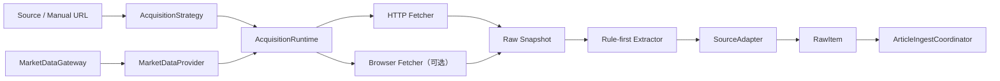

# 技术方案：统一采集与网页抓取能力

## 1. 设计结论

本方案新增 `AcquisitionRuntime` 深 Module，作为所有公开网页、RSS、JSON API 和行情 Provider 底层传输的统一 Seam。它不替代 `SourceAdapter` 或 `MarketDataGateway`：前者继续负责内容语义转换，后者继续负责行情 Provider 路由；运行时只负责把一次外部采集变成可验证、可审计、可重放的结果。

## 2. 参考与取舍

从 op-jsoup 吸收以下做法：

- 请求配置快照与统一 HTTP 出口。
- 响应体上限、Content-Type/BOM/meta/XML 声明联合字符集识别。
- 429 和 5xx 的有限退避重试。
- Cookie、Header、重定向和超时配置。
- 原始抓取、结构化解析与详情补抓分离。
- 规则优先、AI 或昂贵能力兜底。

明确不照搬：

- 不使用 ES 充当状态队列，继续使用 SQLite 与 `data/raw/`。
- 不关闭 TLS 主机名校验，不信任全部证书。
- 不把站点特例继续堆入超大 Schedule 类。
- 不硬编码代理和凭据。
- 不用 `title + publishTime` 作为跨来源唯一幂等键。

## 3. Module 设计

### 3.1 `AcquisitionRequest`

描述一次请求：英文 `requestId`、`purpose`、HTTP method、URI、非敏感 Header、可选 body、总截止时间、最大响应字节数、重定向策略、重试策略、站点键与是否允许浏览器升级。

请求对象创建时完成 URL scheme、超时、Header 名称和大小限制校验。敏感 Header 可以用于实际请求，但 `toAuditView()` 必须删除 `Cookie`、`Authorization`、`Proxy-Authorization` 和 API Key 类字段。

### 3.2 `AcquisitionResponse`

返回最终 URL、HTTP 状态、响应头、原始字节、解码文本、字符集、内容类型、SHA-256、耗时、尝试次数和截断状态。非 2xx、空响应或响应超限以结构化 `AcquisitionException` 表达，不把所有错误压成字符串。

### 3.3 `AcquisitionRuntime`

运行时按以下顺序执行：

1. 校验请求与 URL 策略。
2. 根据 host 获取域名级许可和并发配额。
3. 计算剩余总截止时间并配置连接/读取超时。
4. 发起一次 HTTP 请求并在读取过程中执行字节上限。
5. 根据状态码和异常分类决定是否有限重试。
6. 使用响应头、BOM、HTML meta 或 XML 声明解码。
7. 生成响应哈希与尝试记录。
8. 把原始结果交给快照 Sink；快照失败记录警告但不覆盖成功采集结果。

重试仅允许：429、502、503、504、连接超时和读取超时；默认一次重试，采用带上限的退避。4xx、Schema 漂移、响应超限和策略拒绝不重试。

### 3.4 `RawSnapshotStore`

SQLite `raw_snapshot` 保存元数据，正文写入 `data/raw/acquisition/YYYY-MM-DD/<sha256>.<ext>`。相同哈希复用正文文件，不把敏感请求 Header 写盘。

快照状态包括 `FETCHED`、`FAILED`、`PARSED`；解析版本和策略版本独立保存。重放读取快照正文并重新运行 Extractor，不发起网络请求。

### 3.5 `WebAcquisitionStrategy`

网页能力升级顺序：

1. `STATIC_HTML`：抓取 HTML，执行站点 Profile 和通用正文评分。
2. `EMBEDDED_DATA`：解析 JSON-LD、`__NEXT_DATA__` 等内嵌结构化数据。
3. `PUBLIC_API`：仅使用明确配置的公开 API 模板，不自动猜测或扫描隐藏端点。
4. `BROWSER`：静态结果被判定为空壳且策略允许时执行浏览器渲染。

每一级都产出相同 `AcquisitionResponse` 与快照；升级原因进入尝试审计。浏览器渲染与普通 HTTP 使用独立容量，默认单并发。

### 3.6 Adapter 迁移

- `WebSourceAdapter`：改用运行时获取 HTML，仅负责 `Document -> RawItem`。
- `RssSourceAdapter`：改用运行时获取 XML，继续使用 Rome 解析。
- `WebListSourceAdapter`：列表请求与详情请求都走运行时；详情使用有界并发并保留单项失败。
- `XPostSourceAdapter`：多个公开 JSON/HTML 端点改走运行时，保留 X 专属解析逻辑。
- 行情直连 Adapter：逐个把 `HttpURLConnection` 替换为运行时的单次请求能力；Provider 路由、重试和熔断仍归 `MarketDataGateway`，调用时关闭运行时重试以保持单层策略。

### 3.7 Python 行情进程

- 复用进程级 `httpx.AsyncClient`，启用连接池，不发送 `Connection: close`。
- 当请求来自 Java Provider 时只执行一次 Provider 调用并返回结构化错误；不再重复路由、重试和快照。
- 保留 Python 独立 API 使用场景时，将路由模式显式区分为 `standalone` 与 `provider`，避免隐式双层可靠性。

## 4. 数据模型

`raw_snapshot` 最小字段：

- `id`、`request_id`、`fetch_run_id`、`source_id`。
- `purpose`、`request_url`、`final_url`、`method`。
- `status`、`http_status`、`error_type`、`error_message`。
- `content_type`、`charset_name`、`body_bytes`、`body_sha256`、`body_path`、`truncated`。
- `attempt_count`、`duration_ms`、`policy_version`、`parser_version`。
- `fetched_at`、`parsed_at`。

索引覆盖 `fetch_run_id`、`source_id + fetched_at`、`body_sha256` 和 `status + fetched_at`。

## 5. 错误与降级

- HTTP 成功不等于内容成功；正文评分不足或检测到 JavaScript 空壳时返回 `RENDER_REQUIRED`，由网页策略决定是否升级。
- 单个列表详情失败只记录该详情失败，列表运行可返回部分成功。
- 快照写入失败不丢弃已获得的正文，但 Fetch Run 必须记录警告。
- 浏览器不可用时返回稳定的 `BROWSER_UNAVAILABLE`，不无限重试。
- 行情在线源全部失败时继续使用现有质量状态与最后成功快照规则，不由采集运行时伪造成功。

## 6. 配置

新增 `finscope.acquisition.*`：

- `connect-timeout-ms=5000`
- `read-timeout-ms=10000`
- `deadline-ms=15000`
- `max-response-bytes=8388608`
- `max-retries=1`
- `retry-backoff-ms=250`
- `per-host-min-interval-ms=200`
- `per-host-max-concurrency=2`
- `browser.enabled=false`
- `browser.timeout-ms=20000`
- `browser.max-concurrency=1`

行情 Provider 通过请求策略覆盖为零传输重试，以确保重试只发生在 `ProviderRequestGuard`。

## 7. 交付阶段

### 阶段一：统一 HTTP 内核

实现请求/响应/错误合同、字符集解码、响应大小限制、截止时间和有限重试；迁移 Web、Web List 和 RSS。

### 阶段二：快照与重放

新增 SQLite 元数据和文件正文存储，把 `FetchService` 拆为采集、快照、解析与入库步骤；提供按 snapshot ID 重放的应用层能力。

### 阶段三：复杂网页

增加内嵌 JSON 提取、空壳检测、有界详情并发和可选浏览器 Fetcher；浏览器只作为最后一级。

### 阶段四：行情传输收敛

迁移 Java 行情直连，复用 Python `AsyncClient`，明确 `provider` 模式，验证无双层重试。

## 8. 验收指标

- Java 外部内容请求不再由 Source Adapter 直接创建 `Jsoup.connect` 或 `HttpURLConnection`。
- 现有 Web/RSS/X Adapter 测试通过，并新增编码、重试、大小限制、超时与错误分类测试。
- 抓取失败可以从 `raw_snapshot` 判断 HTTP 状态、错误类型、耗时和策略版本。
- 历史快照能在断网条件下重放解析。
- 动态空壳页能够升级浏览器或给出明确不可用原因。
- 行情同一请求最多只有一个策略层执行重试。
- 完整运行 `cd backend && mvn test` 与 `cd market-data-service && uv run pytest -q`。

## 9. 发布与回退

- Adapter 逐个迁移，每次迁移保留定向回归测试。
- 浏览器能力由配置关闭，安装失败不影响 HTTP/RSS/行情能力。
- 新表和正文文件只追加，不改写现有文章与行情快照。
- 回退代码后遗留的 `raw_snapshot` 与 `data/raw/acquisition` 可安全保留，后续版本继续读取。
