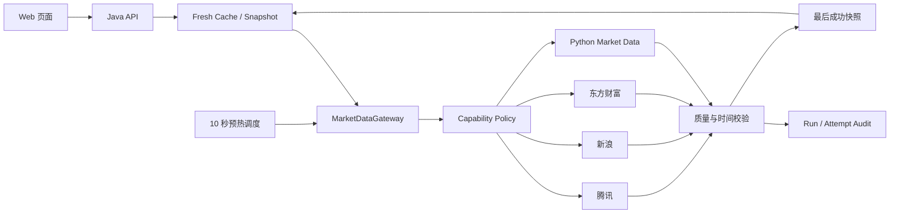

# 技术方案：行情数据实时性与可靠性改造

## 1. 现状证据

对现有代码、运行中服务和近 7 天 `market_data_refresh_run` 审计记录的核对显示：

- `MarketDataGateway` 外层使用 `ProviderRequestGuard` 重试，`JdkFinanceHttpClient` 内部又创建了一个独立 `ProviderRequestGuard`，存在嵌套重试和不可见健康状态。
- 嵌套重试与 5/10 秒 HTTP 超时会将一次免费源失败放大。实际审计中，板块刷新最长约 20.8 秒，资金流失败请求最长约 17.9 秒。
- `MarketDataProvider.timeout()` 已在合同中定义，但统一路由层没有真正将它纳入总截止时间。
- 行情缓存只使用固定 30 秒 TTL，且只要不是 `UNAVAILABLE` 就会写入，包括 `STALE_FALLBACK`。
- 板块目录为单源能力，近 7 天多次返回 `STALE_FALLBACK`。
- 交易时段快照没有两分钟最大降级年龄，历史快照可以无限期保留并被返回。
- 自选页主动刷新并行调用多个端点，但单个慢板块请求仍会拖长整体完成时间。

## 2. 架构决策

保留 Java `MarketDataGateway` 作为唯一行情控制面，Python 行情服务作为能力提供方之一。不在 Java 和 Python 之间重复执行同一级路由、重试和快照决策。

## 3. 组件设计

### 3.1 `MarketTradingSession`

新增可注入 `Clock` 的交易时段策略，统一提供：

- 是否工作日与盘中时段。
- 快照是否在交易时段的两分钟安全兜底内。
- 能力级新鲜 TTL：股票、指数、基金估值和板块盘中为 15 秒。
- 休市时不把前一收盘事实误判为盘中超时，但保留真实 `asOf`。

交易节假日本期使用保守的工作日规则；结构上保留交易日历接口，以便后续接入免费交易日历。

### 3.2 单层 Provider 调用

- `JdkFinanceHttpClient` 只负责一次有界 HTTP GET，不再自建路由健康状态和重试。
- `ProviderRequestGuard` 是唯一重试和熔断层，默认最多重试 1 次，仅重试明确可重试错误。
- 总刷新预算高于对冲延迟，但低于多个串行 HTTP 超时的累加值。
- 取消超时 Future 后不继续用共享线程执行无界任务；免费源 HTTP 客户端自身的连接与读取超时必须小于网关总预算。

### 3.3 故障域和容量隔离

现有 `providerFamily=EASTMONEY` 会把板块、基金、资金流和龙虎榜放在同一家族熔断域。改造后家族健康至少按 `providerFamily + capability` 隔离，仅对同一能力的共享故障做聚合。

执行容量划分为：

- 实时报价：股票、指数和板块报价。
- 基金估值：估值主、备端点。
- 末级事实兜底：已确认净值等应保留独立小型执行容量。
- 慢事实数据：资金流和龙虎榜，不与页面实时报价争抢线程。

### 3.4 新鲜缓存和快照

- 仅 `FRESH_PRIMARY`、`FRESH_FALLBACK` 和全部项都有在线新鲜值的结果可以进入新鲜缓存。
- `STALE_FALLBACK`、`PARTIAL_FRESH` 和 `UNAVAILABLE` 不延长新鲜 TTL。
- 持久化快照仍保留作为灾备，但交易时段读取时必须通过两分钟年龄检查。
- 缓存命中使用结果中的 `retrievedAt`和 `asOf` 计算新鲜度，不只依赖进程内写入时间。

### 3.5 后台预热

新增 `MarketDataWarmupScheduler`：

- 交易时段每 10 秒触发一次。
- 从自选库批量收集股票、基金和关注板块，并同时预热固定指数。
- 能力间并行，同能力使用 `single-flight`，防止调度刷新与用户手动刷新重复放大流量。
- 上一轮未完成时跳过新轮次，不积压无意义刷新。
- 启动、休市和无自选数据时不发起多余外网请求。

## 4. 路由和对冲策略

### 4.1 股票与指数

1. 启动腾讯批量请求。
2. 300 毫秒内未获得完整覆盖时，启动新浪备用批量请求。
3. 按标的代码、时间、完整度和价格合理性合并。
4. 一个 Provider 的部分返回不得使整批失败。

### 4.2 基金

1. 估值主端点与备用端点对冲，末级确认净值使用独立执行器。
2. 确认净值成功不代表盘中估值成功；聚合质量必须保留语义。
3. 估值存在且在交易时段超过两分钟时，只能展示确认净值，不展示过期估值。

### 4.3 板块

本期先修复嵌套重试、超时预算和快照年龄，同时为第二免费源保留 Provider 接口和影子状态。候选源未经连续观测前不直接替换生产主源，避免用不可验证的“多一个端点”换取虚假成功率。

## 5. 审计与可观测性

扩展 `market_data_refresh_run` 并新增 Provider 尝试级记录，最小字段包括：

- `refresh_run_id`、`capability`、`provider_code`、`provider_family`。
- `status`、`error_type`、`retry_count`、`latency_ms`。
- `requested_count`、`accepted_count`、`retrieved_at`。
- `started_at`、`finished_at`。

基于运行记录计算：

- 能力级在线新鲜成功率。
- Provider 成功率、P50/P95 延迟和对冲启动率。
- 旧数据使用率、最大快照年龄和不可用次数。
- 按错误类型的失败分布。

## 6. 错误处理

- HTTP 429、502、503、504、连接超时和读取超时允许最多重试一次。
- Schema 漂移、代码错配、未来时间和数值矛盾不重试，直接转入备用源。
- 线程池拒绝、快照持久化失败和审计失败不得隐藏行情主结果，但必须进入日志和警告。
- 用户手动刷新的一个能力失败时，其他能力继续完成。

## 7. 测试策略

### 7.1 单元测试

- HTTP 客户端一次请求，网关最多一次重试。
- 同厂商不同能力的熔断状态隔离。
- 交易时段、午休、收盘和周末的时间边界。
- 两分钟内快照可降级，超过两分钟不可用。
- 降级结果不进入新鲜缓存。
- 预热重入跳过，能力间失败隔离。

### 7.2 集成与回归

- 现有 1000 组故障组合可用性测试继续通过。
- Web 层合同、前端质量标记和 Python Provider 语义回归。
- 真实免费源验收使用有界超时，不把外网可用性作为自动化测试成功前提。

## 8. 发布与回退

- 新策略通过 `finscope.market-data.*` 配置开关和时间参数启用。
- 先启用单层重试、故障域隔离和年龄校验，再启用 10 秒预热。
- 预热可通过单一配置禁用，同步请求路径仍可工作。
- 数据库只增加审计表和索引，不改写历史行情快照，回退代码不会造成数据丢失。

## 9. 已知边界

腾讯、新浪和东方财富的公开网页端点没有 FinScope 可依赖的服务级别承诺。AKShare 也明确把数据定位为学术研究用途。因此本方案使用“独立免费源 + 严格校验 + 可计算成功率”降低失败，但不宣称获得了交易所或付费供应商级 SLA。

参考：

- [上交所实时行情授权信息商说明](https://english.sse.com.cn/markets/dataservice/list/)
- [AKShare 项目概览与风险提示](https://akshare.akfamily.xyz/introduction.html)
- [Tushare A 股实时分钟接口，作为未来可选专业 API 参考](https://tushare.pro/document/2?doc_id=374)
