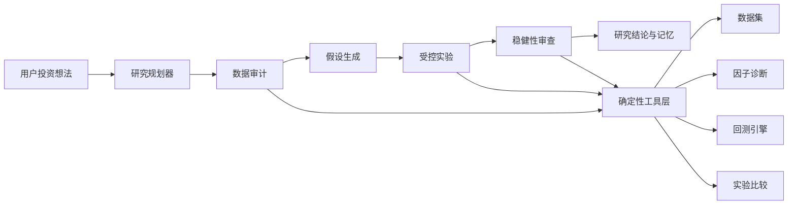

我非常赞同。第三期不应该主要变成“基金持仓管理”，而应该重新定义为：

> **策略研究中枢强化期：把当前策略页升级成由 Agent 驱动、以实验和证据为核心的个人投资研究平台。**

基金定投、轮动和再平衡作为新的策略类型接入这个中枢，而不是单独再做一套孤立功能。

## 当前能力判断

目前基础其实不错：

- 数据集有质量门禁和指纹
- 策略使用受限 DSL
- Agent 不能绕过校验
- 回测由 Java 确定性执行
- 实验、指标、成交和持仓能够持久化
- Agent 引用的指标受到服务端约束

但当前 Agent 仍然是“单次生成器”：

1. 用户输入一句话
2. LLM 生成一个策略 JSON
3. 校验后运行
4. LLM 再生成一次结果解读

[`QuantStrategyAgent`](/Users/machengqian.1/code/MyProject/fin-scope/backend/finscope-service/src/main/java/com/finscope/service/quant/strategy/QuantStrategyAgent.java:55)本质上是一次生成加一次格式修复；[`QuantExperimentAgent`](/Users/machengqian.1/code/MyProject/fin-scope/backend/finscope-service/src/main/java/com/finscope/service/quant/experiment/QuantExperimentAgent.java:24)也只是读取指标后返回结构化解释。

这很安全，但还称不上真正的“研究 Agent”。

## 三种强化路线

### 方案一：继续强化 Prompt

增加更长的提示词、更复杂的 JSON、更漂亮的分析文本。

优点是开发快，缺点是技术含量有限，而且模型看起来更聪明，不代表研究质量真的提高。我不推荐把第三期重点放在这里。

### 方案二：工具驱动的策略研究 Agent

让 Agent 能够制定研究计划、调用确定性工具、比较实验、检查偏差、积累研究记忆，最后输出有证据的结论。

这是我最推荐的路线。

### 方案三：全自动量化科学家

允许 Agent 自动生成大量策略、搜索参数并连续运行实验。

能力很强，但容易过拟合，也会让研究过程失控。可以作为以后第四期的批量实验能力，第三期不宜直接上。

## 推荐的 Agent 架构

不是堆几个 Prompt，也不是为了概念拆成一群“假多 Agent”，而是建立一个有状态的研究工作流：

### 1. 研究规划器

Agent 先把自然语言需求拆成研究任务：

- 投资目标是什么
- 资产范围是什么
- 时间周期多长
- 风险边界是什么
- 哪些假设需要验证
- 使用哪些基准
- 需要运行哪些实验
- 什么结果能够支持或推翻假设

输出不再只是一个策略草案，而是一份 `ResearchPlan`。

### 2. 确定性工具层

Agent 不直接计算，也不能自由访问数据库，只能调用经过后端注册的强类型工具：

- `inspect_dataset`：查看数据范围、覆盖率和风险
- `inspect_factor`：因子 IC、稳定性和相关性
- `create_strategy_draft`：生成受限 DSL
- `run_backtest`：运行确定性实验
- `compare_experiments`：比较策略版本
- `run_cost_stress`：提高交易成本重新验证
- `run_parameter_sensitivity`：测试参数敏感性
- `run_walk_forward`：滚动样本外验证
- `inspect_failure`：分析策略失败原因
- `retrieve_evidence`：读取本地研究证据
- `read_research_memory`：召回历史结论

每个工具都具有 JSON Schema、权限、超时、幂等键和调用预算。

### 3. 稳健性审查 Agent

这是最能提高“含金量”的部分。Agent 不能看到高收益就说策略优秀，而必须主动检查：

- 是否存在未来数据
- 是否存在幸存者偏差
- 样本内和样本外是否一致
- 参数轻微变化后是否失效
- 更换市场阶段后是否仍然成立
- 收益是否集中在少数日期或标的
- 是否依赖极低交易成本
- 因子之间是否高度重复
- 是否只是偶然击中某段行情
- 基准选择是否合理

第三期应补充：

- Walk-forward 滚动验证
- 样本内/样本外切分
- 参数敏感性矩阵
- 牛市、熊市、震荡市分段
- 交易成本压力测试
- 回撤恢复周期
- 因子相关性和稳定性
- 多策略横向比较

这些能力比让 Agent 写更长的分析更有价值。

### 4. 研究记忆

Agent 应该真正记住研究过程，但不能只保存聊天记录。建议分成四类：

- `事实`：数据集指标、实验结果、市场证据
- `推理`：为什么产生这个判断
- `偏好`：你的期限、风险、策略习惯
- `结论`：假设被支持、被否定或仍待观察

每条结论必须记录：

- 来源实验
- 数据指纹
- 策略版本
- 产生时间
- 适用市场环境
- 置信度
- 失效条件

以后你再研究类似策略时，Agent 应该能主动提示：

> 这个假设和实验 #18 类似；此前在提高交易成本后超额收益消失，因此本轮应先验证换手率，而不是重复跑相同策略。

### 5. 有边界的半自主执行

继续保留“Agent 不偷偷运行”的原则，但提升效率：

1. Agent 生成研究计划。
2. 你确认计划和最大实验数量。
3. Agent 可以在批准的范围内连续运行实验。
4. 超出资产范围、参数范围或实验预算时重新等待确认。
5. 所有节点、工具调用、失败、回退和停止原因全部留痕。

项目已有的 [`AgentHarness`](/Users/machengqian.1/code/MyProject/fin-scope/backend/finscope-service/src/main/java/com/finscope/service/agent/AgentHarness.java:11)和[`AgentTraceService`](/Users/machengqian.1/code/MyProject/fin-scope/backend/finscope-service/src/main/java/com/finscope/service/agent/AgentTraceService.java:21)已经具备预算、重复动作控制和节点追踪基础。归因模块甚至已经有“问题规划—联网搜索—本地召回—证据排序—综合结论”的完整流程，[`AttributionAgent`](/Users/machengqian.1/code/MyProject/fin-scope/backend/finscope-service/src/main/java/com/finscope/service/attribution/AttributionAgent.java:94)可以作为量化研究 Agent 的工程参考。

因此不需要重新造一套 Agent 基础设施，应该将现有能力正式抽象成通用研究运行时。

## 策略页强化方向

当前页面把“量化策略平台”和“长期投资工作台”分成两个模式，[`StrategyView`](/Users/machengqian.1/code/MyProject/fin-scope/frontend/src/features/strategy/StrategyView.tsx:8)的割裂感比较强。

第三期建议统一成“策略研究中枢”：

- `研究桌面`：和 Agent 一起定义问题、查看计划和进度
- `策略库`：股票、基金、多资产策略及版本关系
- `实验矩阵`：不同策略、参数、时间段的横向比较
- `稳健性实验室`：样本外、压力测试、市场分段
- `因子与信号`：股票因子、基金动量、估值、回撤等信号
- `研究笔记`：Agent 结论、证据、反例和失效条件
- `数据中心`：股票和基金数据集、质量与来源
- `长期纪律`：保留持仓、研究卡和复盘，但不再占据主流程

前端统一不代表后端揉成一团。后端仍保持：

- `quant`：股票量化
- `fund-strategy`：基金策略和未知价执行
- `strategy`：长期投资纪律
- `agent-research`：研究规划、工具调用、记忆和审计

## 第三期的推荐范围

我建议第三期按照这个顺序建设：

1. 建立通用策略研究会话和 Agent 工具协议。
2. 把现有股票量化能力接入 Agent 研究闭环。
3. 增加实验比较、样本外验证、压力测试和稳健性审查。
4. 增加版本化研究记忆和证据引用。
5. 重构策略页为统一研究中枢。
6. 再把场外基金数据、定投、轮动、再平衡接入同一个框架。
7. 暂不接券商、银行和自动下单。
8. 暂不加入任意 Python 代码执行。

最终目标不是“Agent 帮你生成一个策略”，而是：

> **Agent 帮你把模糊的投资想法转成可证伪假设，设计实验，调用可靠工具，寻找反例，比较结果，积累长期研究记忆，并清楚说明它为什么得出这个结论。**

这才是我认为真正有技术含量、也能在未来几年持续帮助你学习投资的第三期方向。