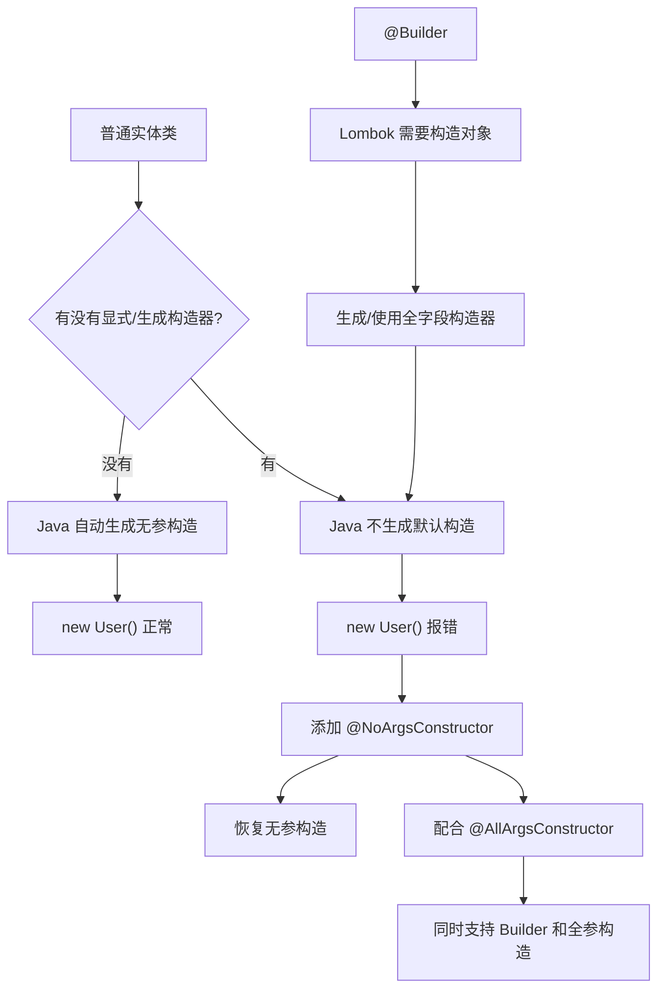

# 雷达线程池注入冲突故障记录

## 现象

应用启动时，Spring 在创建 `RadarHotspotProductionPipeline` 的依赖链时失败，提示需要注入一个 `Executor`，但容器中存在多个线程池 Bean（如 `radarAgentExecutor`、`radarRefreshExecutor` 等）。

## 根因

`RadarEventEnhancementScheduler` 依赖 `Executor` 执行后台增强任务。原来的注入没有指定 Bean 名称，Spring 无法在多个 `Executor` 类型 Bean 中确定应该使用哪一个，因而启动失败。

报错中显示的 `RadarHotspotProductionPipeline` 构造器第 6 个参数只是上层依赖链入口，实际冲突点在 `RadarEventEnhancementScheduler` 的 `Executor` 注入。

## 修复方式

为该依赖显式指定雷达 Agent 线程池：

```java
@Qualifier("radarAgentExecutor") Executor executor
```

这样标题规范化和证据增强任务会固定由 `AppConfig` 中的 `radarAgentExecutor` 执行，不会再与其他业务线程池产生装配歧义。

## 验证

`RadarEventEnhancementSchedulerTest` 已覆盖 Spring 容器按生产构造器创建该调度器，并注册 `radarAgentExecutor` 的场景。

# 使用@Builder注解后为什么导致无参构造失败

这个问题的根源其实不是 `@Data`，**主要是 `@Builder` 改变了实体类的构造器生成规则**。这是 Lombok 里一个很常见的坑。

假设你原来的实体类是：

```java
@Data
public class User {
    private Long id;
    private String name;
    private Integer age;
}
```

你虽然没有写构造方法，但 Java 编译器会自动帮你生成一个默认无参构造：

```java
public User() {
}
```

所以其他地方可以正常写：

```java
User user = new User();
```

但当你加上：

```java
@Data
@Builder
public class User {
    private Long id;
    private String name;
    private Integer age;
}
```

事情就变了。

`@Builder` 为了实现下面这种写法：

```java
User user = User.builder()
        .id(1L)
        .name("Tom")
        .age(20)
        .build();
```

本质上 Builder 最后需要能够把这些字段一次性传进去创建 `User`。

可以把 Lombok 生成的代码近似理解成：

```java
public class User {

    private Long id;
    private String name;
    private Integer age;

    User(Long id, String name, Integer age) {
        this.id = id;
        this.name = name;
        this.age = age;
    }

    public static UserBuilder builder() {
        return new UserBuilder();
    }
}
```

注意这里已经出现了一个构造方法：

```java
User(Long id, String name, Integer age)
```

而 Java 有一条非常基础的构造器规则：

> **只有当一个类完全没有声明任何构造器时，Java 编译器才会自动生成默认无参构造器。**

所以：

```text
没有任何构造器
       ↓
Java 编译器
       ↓
自动生成 User()
```

但是加了 `@Builder` 后：

```text
@Builder
   ↓
Lombok 生成全字段构造器
   ↓
类已经存在构造器
   ↓
Java 不再生成默认 User()
```

于是原来的：

```java
User user = new User();
```

就会报类似：

```text
constructor User in class User cannot be applied to given types
```

这才是你看到的问题。

---

`@Data` 在这里也很容易让人产生误解。

很多人以为：

```java
@Data
```

等于：

```java
@Getter
@Setter
@NoArgsConstructor
@AllArgsConstructor
@ToString
@EqualsAndHashCode
```

**实际上不是。**

`@Data` 大致相当于：

```java
@Getter
@Setter
@RequiredArgsConstructor
@ToString
@EqualsAndHashCode
```

其中是：

```java
@RequiredArgsConstructor
```

而不是：

```java
@NoArgsConstructor
```

`@RequiredArgsConstructor` 主要针对：

```java
final
```

字段和：

```java
@NonNull
```

字段生成构造器，并不能保证你一定拥有一个无参构造。

---

所以实体类如果你既想支持 Builder：

```java
User.builder()
    .name("Tom")
    .age(20)
    .build();
```

又想支持传统无参创建：

```java
User user = new User();
user.setName("Tom");
```

最常见的写法就是：

```java
@Data
@Builder
@NoArgsConstructor
@AllArgsConstructor
public class User {

    private Long id;

    private String name;

    private Integer age;
}
```

这里四个注解分别负责不同事情：

```text
@Data
↓
Getter / Setter
equals / hashCode
toString
@RequiredArgsConstructor 等

@Builder
↓
User.builder()
    .id(...)
    .name(...)
    .build()

@NoArgsConstructor
↓
new User()

@AllArgsConstructor
↓
new User(id, name, age)
同时给 Builder 提供完整构造能力
```

为什么通常 `@NoArgsConstructor` 和 `@AllArgsConstructor` 要一起加？

这是另外一个很容易踩到的点。

你可能会想，只加：

```java
@Data
@Builder
@NoArgsConstructor
public class User {
    private Long id;
    private String name;
}
```

不就行了吗？

问题在于 `@Builder` 的 `build()` 最终类似于：

```java
public User build() {
    return new User(id, name);
}
```

它需要一个：

```java
User(Long id, String name)
```

的构造器。

而你显式增加了：

```java
@NoArgsConstructor
```

之后，Lombok 的构造器生成关系就可能发生冲突，所以工程里最稳妥、最常见的组合就是：

```java
@Data
@Builder
@NoArgsConstructor
@AllArgsConstructor
public class User {
}
```

也就是把两个能力明确告诉 Lombok：

> 我要无参构造，同时也要全参构造。

---

你可以把整个问题记成这么一条链路：



这个问题在 Spring Boot 项目里尤其值得注意，因为很多框架也依赖无参构造器。

比如 MyBatis、Jackson、Hibernate/JPA 等在做反射实例化、JSON 反序列化或者 ORM 映射的时候，都可能对构造器有要求。所以 DTO、VO、DO/Entity 这一类数据对象，经常能看到：

```java
@Data
@Builder
@NoArgsConstructor
@AllArgsConstructor
public class UserDTO {

    private Long id;

    private String name;

    private Integer age;
}
```

这并不是大家喜欢“注解叠叠乐”，而是四个注解解决的是不同能力。

最后你可以记一个特别实用的结论：

> **`new Xxx()` 原来可以，加 `@Builder` 后突然报错，第一反应就去看无参构造器是不是因为 Builder 生成了其他构造器而消失了。**

以及：

```java
@Data
@Builder
@NoArgsConstructor
@AllArgsConstructor
```

是普通 DTO/VO 场景下很常见的组合。不过如果是 **JPA Entity、不可变对象、领域模型**，就不建议无脑套这四个注解，那里面还有 `equals/hashCode`、代理对象、构造器访问级别等另外一批坑。

